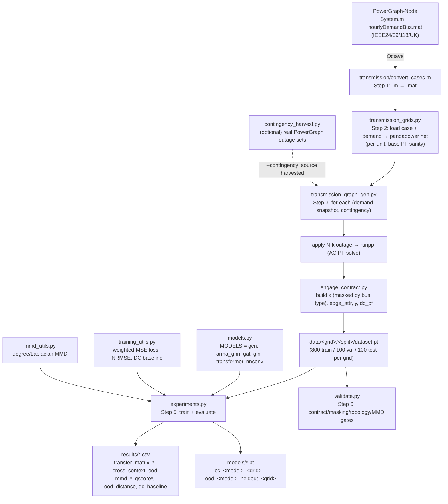
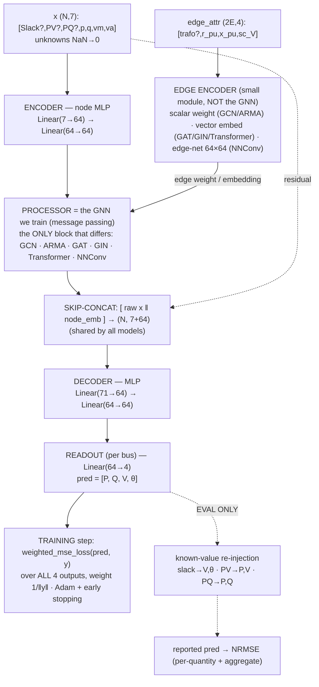

# eval_gnn_generalization_pg

Evaluating the **generalization of GNN architectures for the AC power-flow (PF) node task on transmission grids**.

## Goal
Measure how well graph neural networks trained for node-level AC power flow generalize to **unseen transmission topologies** (and unseen grids), and benchmark this against [PowerGraph](https://github.com/PowerGraph-Datasets), which only trains and tests *within* a single fixed-topology grid. Generalization is quantified with ENGAGE's **g-score** (NRMSE vs. topological distance via MMD).

Because AC power flow is deterministic physics, the value of a learned surrogate is **amortization/speed** across many cases (contingency screening, planning, real-time what-ifs) and **robustness to topology change** — so the primary axis studied is generalization **across contingencies / topological variations**, with transfer between structurally different grids kept as a scientific stress test.

## Approach (one clean pipeline)
ENGAGE's generalization methodology applied to PowerGraph's transmission grids. We reuse:
- **Grid models + real demand** from PowerGraph (`System.m`, `hourlyDemandBus.mat`).
- **pandapower** as the AC power-flow solver.
- **ENGAGE**'s data contract, masking, training loop, MMD and g-score.

Each grid is turned into a **distribution of topologies** by sampling credible N-1/N-k contingencies and re-solving AC power flow, so the MMD/g-score are well-posed.

## Grids
IEEE24, IEEE39, IEEE118, and the UK 29-bus system (PowerGraph's own `System.m` cases).

## Task & data contract
Node-level AC power-flow (PF) state estimation — predict the per-bus state
`[P, Q, V, θ]`. Each grid loading (one demand snapshot + one contingency topology)
is a single PyTorch-Geometric `Data` graph; buses are **nodes**, lines/transformers
are **edges**. `N` = number of buses, `E` = number of lines/transformers. Values are
**per-unit** (pandapower AC PF solution). This is the same ENGAGE contract (which
adapts PowerGraph's `X/Y/edge_*` layout into a single edge-aware `Data` object).

### Data attributes (each `Data` object in `data/<GRID>/<split>/dataset.pt`)
- **`x`** — node **input** feature matrix, dim **`(N, 7)`** = `[Slack?, PV?, PQ?, p_mw, q_mvar, vm_pu, va_degree]`:
  - `Slack?, PV?, PQ?` — one-hot **bus type** (exactly one is 1). Tells the model which
    two of `[P,Q,V,θ]` are *known* for that bus (slack: V,θ · PV: P,V · PQ: P,Q).
  - `p_mw` — active power injection (MW); `q_mvar` — reactive power injection (MVar).
  - `vm_pu` — voltage magnitude (per-unit, ≈ 1.0); `va_degree` — voltage angle (degrees).
  - **Masking:** entries that are *unknown* for a bus type are `NaN` (→ 0 in `forward`),
    so only the known boundary conditions are actually given as inputs.
- **`edge_index`** — connectivity, dim **`(2, 2E)`**. Each line appears in **both**
  directions (undirected grid stored as directed pairs), hence `2E`.
- **`edge_attr`** — edge **input** feature matrix, dim **`(2E, 4)`** = `[transformer?, r_pu, x_pu, sc_voltage]`:
  - `transformer?` — 1 if the branch is a transformer, 0 if a line.
  - `r_pu` — series resistance (per-unit); `x_pu` — series reactance (per-unit).
  - `sc_voltage` — transformer short-circuit voltage `vk_percent` (%); `NaN` for
    lines (→ 0 in `forward`).
- **`y`** — node **target/label** matrix, dim **`(N, 4)`** = `[p_mw, q_mvar, vm_pu, va_degree]`.
  The **complete** solved AC PF state (no masking, no NaNs) — the supervision signal.
- **`dc_pf`** — **DC power-flow baseline**, dim **`(N, 4)`**, same columns as `y`.
  pandapower's `rundcpp` on the *same* (contingency-applied) net: the linear DC
  approximation solves real-power flows and angles, holds voltage magnitudes at their
  controlled setpoints (≈ 1.0, non-controlled buses at 1.0), and carries the DC-solution
  reactive power. Stored per graph so "the GNN beats a cheap linear solver" is
  demonstrated, not assumed.

> Note vs PowerGraph: PowerGraph stores separate `X.mat`, `Y_polar.mat`,
> `edge_index.mat`, `edge_attr.mat` (edges as conductance `G`/susceptance `B`). We use
> ENGAGE's single `Data` object, bus-type one-hots + masking on `x`, and edges as
> `[transformer?, r_pu, x_pu, sc_voltage]`. Full field-by-field rationale is in
> `docs/PowerGraph_to_ENGAGE_design_decisions.md`.

## Model zoo
`GCN`, `ARMA_GNN` (ENGAGE) plus `GAT`, `GIN`, `TRANSFORMER`, `NNConv` (PowerGraph), all under one ENGAGE-style interface (edge-aware, with per-bus-type known-value re-injection).

## Pipeline flow (what the code does, file by file)


## Training method (encode → process → decode, per node)
This is the shared skeleton in `models.py` (`BasePFGNN.forward`), ported from
ENGAGE's GCN/ARMA design with the four PowerGraph models slotted into the same
skeleton. **The entire path below runs on every forward pass — during both training
and evaluation.** Read the diagram top-to-bottom as one forward pass; the only
train-vs-eval difference is the last step (the dashed branch).

Terminology, since these names trip people up:
- **Encoder** = a small MLP that lifts the raw 7-dim node vector into a 64-dim
  latent so the GNN has capacity to work with (nothing to do with autoencoders).
- **Edge encoder** = a *separate, tiny* module (**not** the GNN) that turns the 4
  edge attributes into something the GNN layer can consume. The label in parentheses
  says *which kind* each model uses: a scalar weight (GCN/ARMA), a vector embedding
  (GAT/GIN/Transformer), or a per-edge weight-matrix net (NNConv).
- **Processor** = **the GNN we actually train** — the message-passing layers. This is
  the *only* block that differs across the six architectures.
- **Skip-concat** = re-attach the raw `x` (residual connection) so the decoder keeps
  direct access to the original features, incl. the known boundary values. Shared by all.
- **Decoder** = a small MLP that projects the 64-dim latent back down toward the answer.
- **Readout** = the final `Linear(64→4)` giving the four outputs **per bus** (node-level,
  *not* graph pooling).

The **loss is identical for every model and both experiments**: weighted MSE over
all four outputs.

*The solid path (down to the TRAINING box) is what happens every training step. The
dashed branch is applied only at evaluation: it overwrites the known quantities with
their true inputs before scoring, so re-injection never leaks into the loss.*

## Repository layout
```
eval_gnn_generalization_pg/
├── README.md                     # this file — start here
├── docs/                         # design & experiment documents (the "why")
│   ├── Pipeline_Report.md        # ← as-built report: flow diagram + run guide
│   ├── PowerGraph_to_ENGAGE_design_decisions.md
│   ├── Experimental_Design_transmission_GNN_generalization.md
│   ├── Layer2_implementation_plan.md
│   └── PowerGraph-Node_deep_dive.md
└── transmission/                 # grid conversion + data generation
    ├── convert_cases.m           # Step 1: System.m -> .mat (Octave, one-time)
    ├── cases/                     # Step 1 output: IEEE24/IEEE39/IEEE118/UK .mat
    └── README.md                 # per-step instructions for this folder
```

## Detailed pipeline report
For a full walkthrough — **flow diagram**, technical grounding, file-by-file
explanation of how the pieces connect, and a run guide (incl. single grid /
single architecture) — see [`docs/Pipeline_Report.md`](docs/Pipeline_Report.md).

## Hardware / GPU
Training and evaluation use a **GPU automatically** when available
(`get_device()` → `cuda:0` if `torch.cuda.is_available()`, else CPU) — no code
change needed. **Data generation is CPU-only** (pandapower Newton-Raphson AC
power-flow solves do not use the GPU).

## How to run the experiments (step by step)
> **On Windows with a GPU and no environment yet?** Follow the dedicated
> copy‑paste guide: [`docs/Reproduce_on_Windows.md`](docs/Reproduce_on_Windows.md)
> (venv, CUDA PyTorch + PyG, data generation, and running one model at a time).

This guide is built up **incrementally, one implementation step per branch**. Each
step below is marked with its status so you always know what is runnable today.

> Branches are *stacked*: `step-2` builds on `step-1`, `step-3` on `step-2`, etc.
> To review/run a given step, check out its branch:
> `git fetch origin && git checkout step-1-grid-conversion`

### Prerequisites (all steps)
- **Python 3.10+**
- A checkout of **PowerGraph-Node** (for the raw `System.m` grids and hourly demand):
  https://github.com/PowerGraph-Datasets/PowerGraph-Node
- Python packages (installed per step as they become needed):
  `pandapower`, `torch`, `torch_geometric`, `scipy`, `numpy`, `pandas`,
  `networkx`, `omegaconf`. A pinned `requirements.txt` is added in a later step.

### Step 1 — Convert the grids  ✅ available on `step-1-grid-conversion`
Turns PowerGraph's `System.m` files into committed `.mat` cases. You normally only
run this once (the `.mat` files are committed, so you can skip straight to Step 2).
Needs **Octave** only.
```bash
# install Octave (free, no license):  sudo apt-get install -y octave   # or: brew install octave
export POWERGRAPH_NODE_DIR=/absolute/path/to/PowerGraph-Node/13_Power_system
octave --no-gui --eval "cd transmission; convert_cases"
```
Full details, expected output, and a verification snippet: see
[`transmission/README.md`](transmission/README.md).

### Step 2 — Load grids into pandapower  ✅ available on `step-2-grid-loader`
Loads the converted `.mat` cases as re-solvable pandapower networks and loads the
per-bus hourly demand profiles. This is the bridge between Step 1's files and the
data generator in Step 3.
```bash
pip install pandapower scipy numpy          # (numba optional, for speed)
export POWERGRAPH_NODE_DIR=/absolute/path/to/PowerGraph-Node/13_Power_system
python3 transmission_grids.py               # self-test: loads + runs base power flow
```
Expected output (one line per grid), each `converged=True`:
```
IEEE24   buses=  24 loads=  17 gens= 10 ext_grid=1 lines= 33 trafos=  5 converged=True demand=(24, 35040)
IEEE39   buses=  39 loads=  21 gens=  9 ext_grid=1 lines= 35 trafos= 11 converged=True demand=(39, 35040)
IEEE118  buses= 118 loads=  91 gens= 53 ext_grid=1 lines=175 trafos=  9 converged=True demand=(118, 35040)
UK       buses=  29 loads=  29 gens= 23 ext_grid=1 lines= 86 trafos=  4 converged=True demand=(29, 35040)
```
Key functions (`transmission_grids.py`): `get_transmission_grid_codes()`,
`load_case(code)`, `load_hourly_demand(code, variant="new")`.
### Step 3 — Generate the datasets  ✅ available on `step-3-data-generation`
The heart of the pipeline: turns each grid into a **distribution of topologies**
by sampling N-1/N-k line contingencies + real hourly demand, **re-solving AC
power flow** (`pp.runpp`), filtering (convergence / connectivity / voltage
sanity), and emitting ENGAGE-format `Data` into `data/<CODE>/<split>/dataset.pt`.
```bash
pip install torch torch_geometric networkx pandas numba   # numba = big speedup
export POWERGRAPH_NODE_DIR=/absolute/path/to/PowerGraph-Node/13_Power_system
# quick smoke test:
python3 transmission_graph_gen.py --grid IEEE24 --n_train 30 --n_val 6 --n_test 6 --max_k 2 --out_dir data
# full generation (all four grids):
python3 transmission_graph_gen.py --grid all --n_train 800 --n_val 100 --n_test 100 --max_k 2 --out_dir data
```
Options: `--max_k` (max simultaneous outages), `--redispatch` (AC OPF instead of
PF-with-slack), `--seed`, `--max_tries_factor`. Each emitted sample:
`x (N,7)`, `edge_index (2,2E)`, `edge_attr (2E,4)`, `y (N,4)`, `dc_pf (N,4)`;
`2E` varies with the contingency depth (that variation is what makes MMD/g-score
meaningful). Contract details + the vendored ENGAGE extractors are in
`engage_contract.py`.
### Step 4 — The model zoo  ✅ available on `step-4-model-zoo`
Six architectures behind one interface (`models.py`): `GCN`, `ARMA_GNN` (ENGAGE)
and `GAT`, `GIN`, `TRANSFORMER`, `NNConv` (PowerGraph). Every model is genuinely
edge-aware (consumes `edge_attr`) and shares the physics-aware `inference()`
known-value re-injection (slack V/θ, PV P/V, PQ P/Q) applied at test time.
```python
from models import MODELS          # {'gcn','arma_gnn','gat','gin','transformer','nnconv'}
model = MODELS['gat'](input_dim=7) # forward(data) -> pred (N, 4)
```
Quick self-check (forwards every model on a generated batch):
```bash
python3 - <<'PY'
import torch; from torch_geometric.loader import DataLoader; from models import MODELS
ds = torch.load('data/IEEE24/train/dataset.pt', weights_only=False)
batch = next(iter(DataLoader(ds, batch_size=4)))
for n, cls in MODELS.items():
    m = cls(input_dim=7); m.eval()
    with torch.no_grad(): out = m(batch)
    print(n, tuple(out.shape), torch.isfinite(out).all().item())
PY
```
### Step 5 — Run the experiments  ✅ available on `step-5-experiments`
Trains every architecture and produces the study's outputs: the cross-context
**transfer matrix** (train on one grid → test on all), **leave-one-grid-out OOD**,
the **g-score** (NRMSE vs topological distance via MMD), **per-quantity errors
(P, Q, V, θ)**, and the **DC-PF baseline**.
```bash
pip install -r requirements.txt
# quick smoke test (few epochs, two models, two grids):
python3 experiments.py --experiment both --models gcn gat --epochs 20 \
    --grids IEEE24 IEEE39 --data_dir data --out results
# full run (all grids + all models), and SAVE the trained models:
python3 experiments.py --experiment both --data_dir data --out results \
    --epochs 200 --save_models models
```
Outputs land in `results/`: `transfer_matrix_<model>.csv`, `cross_context.csv`
(incl. per-quantity), `mmd_degree.csv`/`mmd_laplacian.csv`, `dc_baseline.csv`,
`gscore.csv` (cross-context g-score) + `gscore_smallN.csv`, `gscore_ood.csv`
(OOD g-score — per model over held-out grids; the better-posed one at N=4),
`ood.csv`. Supporting code: `training_utils.py` (training loop +
metrics), `mmd_utils.py` (distribution-based MMD — the correct, non-degenerate
version).

**Saving / reusing trained models.** Pass `--save_models <dir>` to write every
trained model's weights, named `cc_<model>_<train_grid>.pt` (cross-context) and
`ood_<model>_heldout_<grid>.pt` (OOD). Reload one with:
```python
import torch; from models import MODELS
m = MODELS["gat"](input_dim=7); m.load_state_dict(torch.load("models/cc_gat_IEEE39.pt")); m.eval()
```

### Run only ONE grid or ONE architecture
Both scripts take subset flags, so you never have to run everything:
```bash
# generate a single grid
python3 transmission_graph_gen.py --grid IEEE39 --n_train 800 --n_val 100 --n_test 100 --out_dir data

# a single architecture (all grids)
python3 experiments.py --experiment both --models gat --data_dir data --out results --save_models models

# a subset of grids (needed for meaningful transfer) + one model, quick
python3 experiments.py --experiment cross --models gcn --grids IEEE24 IEEE39 \
    --epochs 20 --data_dir data --out results
```
> Cross-grid transfer needs ≥2 grids; `--grids IEEE39` alone yields only the
> within-grid diagonal.

### Step 6 — Validation gates  ✅ available on `step-6-validation`
Automatic checks that catch the failures that would make the study *invalid*
(not merely buggy): conversion fidelity, data-contract shapes, masking
correctness, topology variation, and **MMD non-degeneracy** (the exact bug from
the earlier attempt). Run it before trusting any results; exit code is non-zero
if any gate fails (CI-friendly).
```bash
python3 validate.py                    # conversion checks only
python3 validate.py --data_dir data    # + contract / masking / topology / MMD
```
Expected: `ALL GATES PASSED`, with the MMD gate confirming within-grid MMD <
cross-grid MMD and cross-grid MMD non-constant.

### Step 7 — Harvest real contingencies from PowerGraph-Graph  ✅ available on `step-7-harvest-contingencies`
Optional contingency *source* (design decision D11): instead of random N-k
outages, drive Step 3 with the **actual outage sets** PowerGraph-Graph simulated.
We reuse only their *topology* (which lines are out — detected as all-zero rows in
`Ef.mat`, mapped via `blist.mat`) and **re-solve the AC power flow ourselves**, so
the labels are still ours. Code: `contingency_harvest.py`.
```bash
# 1. Download PowerGraph-Graph raw data (~2.7 GB) once:
wget -O pgg.tar.gz "https://figshare.com/ndownloader/files/46619158" && tar -xf pgg.tar.gz
export PG_GRAPH_RAW_DIR=/absolute/path/to/extracted/root   # <root>/<name>/raw/*.mat
pip install mat73        # needed to read MATLAB v7.3 .mat files
# 2. Generate using harvested contingencies:
python3 transmission_graph_gen.py --grid IEEE24 --contingency_source harvest \
    --pg_graph_raw "$PG_GRAPH_RAW_DIR" --n_train 800 --n_val 100 --n_test 100 --out_dir data
```
The default remains `--contingency_source random` (no download needed). Harvested
samples record their outage in `dataset_src.csv` with `source=harvest`.

> Note: the study needs **only** the PowerGraph-Node GitHub repo (grid `System.m`
> + `hourlyDemandBusnew.mat`, ~45 MB). The large figshare downloads
> (PowerGraph-Node's 1.08 GB tensors, PowerGraph-Graph's 2.7 GB) are **not**
> required — the 2.7 GB set is only for this optional harvesting step.

## End-to-end walkthrough (no prior experience needed)
```bash
# 0. Clone this repo and PowerGraph-Node side by side
git clone https://github.com/Davjes15/eval_gnn_generalization_pg.git
git clone https://github.com/PowerGraph-Datasets/PowerGraph-Node.git
cd eval_gnn_generalization_pg
git checkout step-5-experiments          # latest step branch

# 1. Install dependencies
pip install -r requirements.txt

# 2. Point at PowerGraph-Node's power-system folder (has the hourly demand files)
export POWERGRAPH_NODE_DIR="$(pwd)/../PowerGraph-Node/13_Power_system"

# 3. (Optional) re-convert the grids — the .mat files are already committed,
#    so you can skip this unless you changed the source cases. Needs Octave.
#    octave --no-gui --eval "cd transmission; convert_cases"

# 4. Generate the datasets (contingencies + AC power-flow re-solve)
python3 transmission_graph_gen.py --grid all --n_train 800 --n_val 100 --n_test 100 --out_dir data

# 5. (Recommended) validate the generated data before trusting results
python3 validate.py --data_dir data

# 6. Run the experiments
python3 experiments.py --experiment both --data_dir data --out results

# 7. Read the results
ls results/         # transfer_matrix_*.csv, gscore.csv, gscore_ood.csv, ood.csv, dc_baseline.csv, ...
```

## Status
**Steps 1–7 implemented** (grid conversion → loader → data generation → model
zoo → experiments → validation gates → optional PowerGraph-Graph contingency
harvesting). The pipeline runs end-to-end.
See [`docs/Layer2_implementation_plan.md`](docs/Layer2_implementation_plan.md) for
the full plan and the reasoning behind each step.

## License
TBD.
