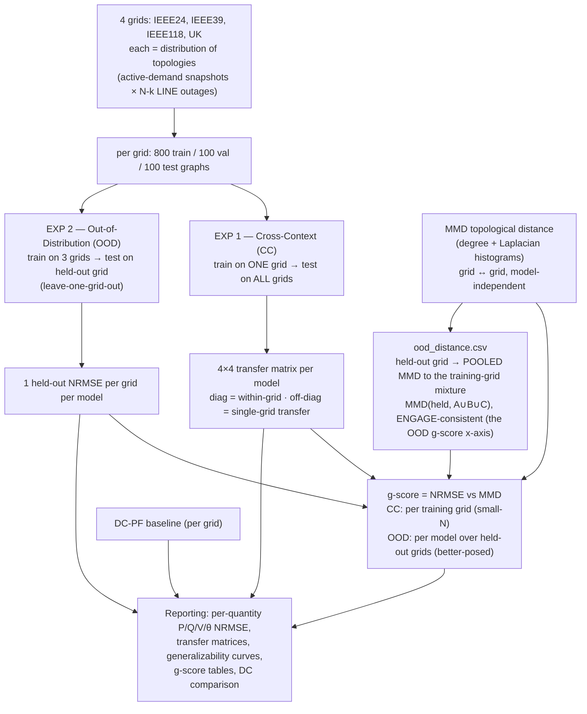

# Experimental Design — Generalization of GNN Architectures for Transmission Grids

Status: **design specification** (no experiments run yet). This document defines, for each of the two layers, the **research question**, the **experimental setup**, and the **methodology**. It is the companion to `PowerGraph_to_ENGAGE_design_decisions.md` (which records *why* each choice was made); this file records *what experiment we actually run*.

## Overarching goal
Study **how well GNN architectures generalize to unseen transmission topologies** for the AC power-flow node task, and benchmark this against PowerGraph, which only ever trains and tests *within* a single fixed-topology grid. Generalization is quantified with ENGAGE's g-score (NRMSE vs. topological distance via MMD).

### Framing (power-systems motivation — read this first)
AC power flow is **deterministic physics**: given a grid's full model (topology + impedances + injections) you can just solve it with Newton-Raphson. So the value of a learned GNN surrogate is **not** "predict a grid you could otherwise solve" — it is **(i) amortization/speed** across huge numbers of cases (contingency screening, planning scenarios, real-time what-ifs) and **(ii) staying accurate as topology changes**. Accordingly:
- **Primary, operationally-motivated axis:** generalization **across contingencies / topological variations** of transmission grids (and to *related* unseen systems). This is the headline claim and is exactly what Layer 2's contingency distribution enables. As executed, that variation is random N-1/N-2 outages of in-service **lines** only — no transformer or generator outages, no busbar splits or switching actions, and islanding cases are discarded rather than modelled (limitation L9 in [`Audit_response.md`](Audit_response.md)).
- **Secondary, scientific stress test:** transfer between structurally very different grids (e.g. IEEE24 → UK). Interesting as a limit test, but it has weak *operational* motivation, so it is reported as a stress test, not the main result.

**What each rung of the ladder actually varies.** The three arms are not a clean topology-only sequence, and the qualifier belongs here rather than in a footnote (limitations L4, L8, L9):

| rung | what changes relative to the previous one |
|---|---|
| within-grid (Regime A) | active demand only, one fixed topology per grid |
| cross-context / same grid (Regime B) | blocked temporal split **and** line contingencies, jointly (L8) |
| unseen grid (leave-one-grid-out) | a different **system**: scale, structure and the Regime B protocol at once (L4) |

The four cases differ in scale as much as in structure — nominal load 2,850 MW / 24 buses (IEEE24), 6,254 MW / 39 buses (IEEE39), 3,733 MW / 118 buses (IEEE118), 56,326 MW / 29 buses (UK), read from the committed `transmission/cases/*.mat` through `transmission_grids.load_case`. So the unseen-grid arm measures generalization to an unseen **system** (scale + topology + protocol), not isolated topology generalization, and no unit system removes the scale part of that shift (Decision 20).

## Grids
IEEE24, IEEE39, IEEE118, and the UK 29-bus system (PowerGraph's own `System.m` cases). Task: **node-level AC power-flow (PF) state estimation** — predict per-bus `[P, Q, V, θ]`.

### Metrics & baselines (applies to both layers)
A single aggregate NRMSE **overstates** performance, because the four targets are not equally hard: **V** is tightly bounded (~0.95–1.05 pu) and nearly trivial to predict, while **θ (angles)** and **Q (reactive power)** are the hard, informative quantities. Therefore every result must report:
- **Per-quantity errors — V, θ, P, Q separately** (not just the aggregate `nrmse_range`).
- **The DC-PF baseline** (`training_utils.test_dc_pf`), and ideally a warm-started single Newton step, so "the GNN beats trivial physics" is *demonstrated*, not assumed.
- **Topological distance via MMD** (degree + Laplacian). Because power engineers reason in **electrical distance** (impedance-weighted), optionally complement MMD with an electrical measure (e.g. X/R or short-circuit-ratio distribution distance, or a PTDF-based distance) to strengthen power-systems credibility. MMD stays the primary distance for the g-score; the electrical measure is a corroborating cross-check.

## Experimental design at a glance


---

# The two-layer approach (and why it is split this way)

| | Layer 1 — Correct & sanity-check what exists | Layer 2 — The well-posed generalization study |
|---|---|---|
| Data | PowerGraph's existing fixed-topology node snapshots | ENGAGE-format data regenerated from `System.m` with a **distribution of topologies** |
| Models | The GCN (and others) already trained in the PowerGraph-Node pipeline | Full model zoo retrained under ENGAGE's contract |
| Normalization | **Must be harmonized to per-unit** (else results are invalid) | Per-unit throughout |
| Primary metric | **Cross-grid NRMSE transfer matrix** | g-score (NRMSE vs MMD) + transfer matrix |
| g-score | Provisional only (ill-posed: 1 topology/grid, few points) | Well-posed (distribution of topologies per grid) |
| Purpose | De-risk, validate software, get a first honest result | The publishable benchmark |

**Why they are not cleanly separable:** a "pure" Layer 1 (just fix bugs, keep PowerGraph's per-grid max-abs normalization and single-topology MMD) will *run but not be insightful*. Two Layer-2 concerns must be pulled forward into Layer 1 to make it meaningful: (1) **per-unit normalization**, and (2) awareness that the **g-score needs a distribution of topologies** — which Layer 1 does not have, so its g-score stays provisional.

---

# LAYER 1 — Corrected zero-shot cross-grid transfer of existing models

## Research question
**RQ1:** When a GNN trained for node-level PF *within one transmission grid* is applied **zero-shot to an unseen transmission grid**, how much does accuracy degrade, and does that degradation grow with the topological distance between grids?

Sub-questions:
- **RQ1a:** How large is the within-grid → unseen-grid accuracy gap (the "generalization gap") relative to PowerGraph's within-grid numbers?
- **RQ1b:** Is the ordering of test grids by error consistent with their topological distance (degree/Laplacian MMD) from the training grid?

## Experimental setup
- **Models under test:** the checkpoints already trained in the PowerGraph-Node pipeline (currently GCN for IEEE118, IEEE24, UK; extend to the other architectures/grids as available).
- **Protocol:** train-on-one-grid, test-on-the-other-three (leave-the-training-grid-out), zero-shot (no fine-tuning on the target grid).
- **Held-out reference:** each model's *own* within-grid test split (PowerGraph's regime) is the baseline the cross-grid numbers are compared against.
- **Fixed factors:** identical preprocessing, mask convention, and metric across every (train, test) pair — no mixing.

## Methodology
1. **Harmonize normalization to per-unit (mandatory).** Replace PowerGraph's per-grid max-abs scaling with a **physically consistent per-unit basis** (`baseMVA`/`baseKV`) so features/targets are comparable across grids. Without this, cross-grid NRMSE conflates a units/scaling mismatch with true generalization and is not interpretable.
2. **Inference across sizes.** GNN message passing is size-agnostic, so a model trained on grid A runs on grid B despite different bus counts — verify shapes (`x` = `(N,·)`) and that the mask/target columns align.
3. **Primary result — the cross-grid NRMSE transfer matrix.** For every (train grid, test grid, architecture), report NRMSE (ENGAGE `nrmse_range`). This directly answers RQ1/RQ1a and is valid once normalization is harmonized.
4. **Topological distance (secondary).** Compute degree- and Laplacian-spectrum MMD between grids, but **fix the two known defects first**:
   - build descriptors so the kernel is not saturated (retune `sigma_degree`, `sigma_laplacian`; the default `sigma_laplacian=1e-2` collapses every pair to √2);
   - compute topology on the **physical one-line graph, not the Ybus pattern with self-loops** (PowerGraph `edge_index = find(Ybus)` includes the diagonal).
5. **g-score = provisional.** Report it, but flag that with **one topology per grid** and only 3–4 grids the g-score is fit to 3–4 points and is statistically fragile; it is *not* the headline. Use `get_generalization_score_raw` (no percentile trim) given the tiny sample.
6. **Validity checklist:** confirm (a) normalization harmonized, (b) MMD non-degenerate, (c) mask identical across pairs, (d) no target leakage from the training grid's scaling.

> **Superseded on item 1.** Per-unit conversion turned out to be a *no-op* on these four cases:
> all of them carry `sn_mva = 100`, so a per-unit basis divides P and Q by one shared constant and
> changes no ratio and no cross-grid spread. The defect that actually mattered was inside each
> sample — voltage magnitude contributed 5e-8 of the training loss — so the implemented protocol is
> per-unit **followed by a per-quantity z-score fitted on training data only** (`--normalize
> pu_zscore`, Decision 20, measurements in `docs/Normalization_assessment.md`). Item 6(d) is
> honoured by the scaler-fitting rule in "Representation" below: never fit on a target grid.

## Deliverables
- NRMSE transfer matrix per architecture (the headline).
- Within-grid vs unseen-grid gap table (benchmark against PowerGraph).
- Provisional MMD/g-score with explicit caveats.
- A short validity note stating what Layer 1 can and cannot conclude.

## Threats to validity (Layer 1)
- **Normalization mismatch** (fixed by step 1) — the dominant risk.
- **Single topology per grid** → g-score ill-posed (resolved only in Layer 2).
- **MMD on admittance graph with self-loops** → distorts "topological distance."
- **Small number of grids** → weak statistics for any distance-based summary.

---

# LAYER 2 — Well-posed generalization benchmark with a topology distribution

## Research questions
**RQ2 (primary — operational):** Across a **distribution of credible transmission topologies** (a base grid + its N-1/N-2 in-service-line outages; no transformer, generator, busbar or switching actions, islanding discarded — L9), which GNN architectures **stay accurate on unseen topologies**, and how does that error scale with topological distance (MMD) from the training distribution? Does the GNN beat the DC-PF baseline, per quantity?

Sub-questions:
- **RQ2a:** Does a physically consistent, ENGAGE-format dataset (per-unit, bus-type NaN masking, `dc_pf` baseline) change the architecture ranking vs Layer 1?
- **RQ2b:** How does each architecture's g-score compare (both the cross-context g-score and the better-posed **OOD g-score** over held-out grids), and does edge-awareness (GAT/GIN/Transformer/NNConv using `edge_attr`) help on transmission grids?
- **RQ2c (secondary — scientific stress test):** Out-of-distribution across *different* grids — leave-one-grid-out (train on three grids, test on the fourth, incl. IEEE24↔UK). Reported as a limit test, not the operational headline. The held-out grid differs from its training mixture in scale as well as structure (nominal load 2,850–56,326 MW over 24–118 buses), so what this arm measures is transfer to an unseen **system**, not isolated topology transfer (L4).
- **RQ2d:** Per-quantity behaviour — is the apparent accuracy driven by trivially-bounded **V**, and how do the harder **θ** and **Q** generalize?

## Experimental setup
- **Data:** regenerated from PowerGraph's `System.m` into **ENGAGE `Data`** (Decision 1/4/5), with a **distribution of topologies per grid** produced by contingency perturbation (see methodology; as executed, random N-1/N-2 **line** outages only — L9). Operating points via **Route B** (real hourly demand) and/or Route A. Only **active** demand varies across samples: reactive demand stays at each case's base-case value, mirroring PowerGraph's `gendataopf.m` (`transmission_graph_gen._apply_demand` writes `p_mw` only; limitation L6), so every "operating-point variation" in this document means active-demand variation.
- **Model zoo (unified, ENGAGE interface):** `GCN`, `ARMA_GNN`, `GAT`, `GIN`, `TRANSFORMER`, `NNConv` — all with input dim 7, output dim 4, `edge_attr` dim 4, ENGAGE masking, and the per-bus-type `inference()` re-injection.
- **Experiments:** ENGAGE's **Cross-Context** (ordered train-grid/test-grid) and **Out-of-Distribution** (leave-one-grid-out) scripts, unchanged.
- **Seeds:** multiple seeds per configuration for error bars — seeds vary training randomness (weight init, batch order) on **one** generated dataset, so the spread supports no claim about variability over data realizations (L5). Five architectures run seeds 0/100/300/700/1000; NNConv runs 0/100/300, a deliberate, approved compute trade-off (L2, Decision 17).

## Methodology — data generation engine
1. **Grid model:** convert each `System.m` → pandapower net via Octave + `from_mpc` (Decision 5); commit the `.mat`.
2. **Sample a credible topology (contingency):** remove line(s)/branch(es) — N-1, then N-2/N-k — optionally generator outages. Reject islanding (or handle islands); retune disconnection probabilities for meshed transmission. *As executed, only the line branch of this option was used: random N-1/N-2 outages of in-service lines, no generator or transformer outages, and islanding draws discarded rather than modelled (L9).*
3. **Set demand:** real hourly profile (`hourlyDemandBus.mat`, Route B) or sampled (Route A) — **active** power only; reactive demand is left at the base case (L6).
4. **Re-solve the physics — the re-solve engine.** A topology change invalidates all stored node values, so each sample is a fresh solve:
   ```python
   import pandapower as pp
   net.line.at[idx, "in_service"] = False   # the outage
   net.load["p_mw"] = demand_p              # ACTIVE demand only; q_mvar stays at base case (L6)
   pp.runpp(net)                            # AC power flow (Newton-Raphson)
   # net.res_bus.vm_pu / va_degree, net.res_gen.p_mw/q_mvar, net.res_line...
   ```
   Use `pp.runpp` (slack absorbs imbalance) or `pp.runopp` (generator re-dispatch, more realistic post-contingency); `pp.rundcpp` for the `dc_pf` baseline. This runs in **ENGAGE's** pandapower pipeline (`graph_gen.py` + `powerdata-gen`), not PowerGraph's MATLAB `gendataopf.m`.
5. **Filter:** drop non-converged / islanded / voltage-violating / overloaded solutions.
6. **Convert:** `get_node_features` + `get_edge_features` → ENGAGE `Data` (bus-type one-hot, NaN masking, `dc_pf`; **per-unit applies to the edge impedances only** — node quantities are written in raw MW/Mvar/p.u./degrees, and any node-level scaling is a training-time choice, see "Final protocol" below).
7. Repeat → each grid becomes a **cloud of graphs with varying topology + loading** = the distribution the MMD/g-score requires.

### Optional — harvest contingencies from PowerGraph-Graph
PowerGraph-**Graph** is a cascading-failure dataset: each sample is an outage state (removed lines), `exp.mat` marks the triggering branch(es), and `of_*` labels demand-not-served. Use it to make outages **credible and grid-specific**:
- harvest the **outage line-sets** (topologies only) instead of blind random N-k;
- **stratify** sampling toward consequential contingencies (those causing DNS) to widen the MMD range;
- build a **curriculum** benign N-1 → severe cascades.
Caveats: use only their **topology**, then **re-solve AC PF yourself** (step 4) for node targets; drop cascade end-states that are islanded/blackout (no converged single-grid PF).

## Methodology — evaluation
- **ENGAGE bus-type NaN masking + norm-weighted MSE** throughout (Decision 6), with node feature/target scaling selected explicitly per run (`--normalize`, Decision 20) and **all metrics computed in physical units after de-normalization**.
- **Metrics:** `nrmse_range` **broken out per quantity (V, θ, P, Q)** as well as aggregate; degree + Laplacian **MMD** on the **physical** topology with tuned sigmas; **g-score** now well-posed because each grid is a distribution of topologies.
- **Baselines:** always report the **DC-PF baseline** (`test_dc_pf`), optionally a warm-started single Newton step, so improvement over trivial physics is explicit.
- **Distance:** MMD is primary; optionally add an **electrical-distance** cross-check (X/R or short-circuit-ratio distribution distance, or PTDF-based) since MMD ignores impedances/loading.
- **Two g-score flavours** (both produced by `experiments.py`):
  - **Cross-context g-score** (`gscore.csv`) — *per training grid* over its unseen TEST grids. At only 3 points/training grid the ENGAGE 2/98 trim collapses it, so the pooled no-trim `gscore_cc_aggregate.csv` is the appropriate reading.
  - **OOD g-score** (`gscore_ood.csv`, `compute_ood_gscores`) — *per model* over the held-out grids of the leave-one-grid-out experiment (one point per held-out grid, up to 4), with the topological distance = **pooled Laplacian-MMD from each held-out grid to the pooled training-grid mixture** (`MMD(held, A∪B∪C)`, ENGAGE-consistent — not a mean of pairwise MMDs; see Decision 14), no trim, NaN cells dropped. This is the **better-posed** g-score at N=4 and the one most aligned with the operational question (generalize to a new grid after training on several); mirrors ENGAGE reporting a g-score for both its CC and OOD experiments.
- **Cross-Context matrix** and **OOD leave-one-out** results per architecture, with seeds → error bars.
- **Benchmark vs PowerGraph:** compare within-topology (PowerGraph regime) to unseen-topology (this study) for the shared architectures, reported as **relative degradation** under our own consistent pipeline (numeric values are not directly comparable across the two masking/normalization conventions).

## Deliverables
- ENGAGE-format transmission datasets (four grids, topology distribution) + committed `.mat` cases.
- Full architecture comparison: Cross-Context + OOD g-scores, NRMSE transfer matrices, edge-awareness ablation.
- Reproducible pipeline (Octave conversion committed; pandapower-only downstream).

## Threats to validity (Layer 2)
- **Contingency realism / connectivity** — reject islanding, tune outage depth so descriptors actually spread.
- **PF vs OPF post-contingency** — document the choice (slack absorption vs re-dispatch); it affects targets and post-contingency realism (real systems re-dispatch via AGC/OPF).
- **Metric inflation by V** — aggregate NRMSE can look strong purely from tightly-bounded voltages; per-quantity reporting (RQ2d) guards against this.
- **Topological vs electrical distance** — MMD captures pure structure, not impedance/loading; the optional electrical-distance cross-check mitigates over-interpretation.
- **Sigma/kernel tuning** for MMD — validate against ENGAGE's `ggme` reference.
- **Demand coverage** (Route B) — ensure the hourly profile spans seasonal/daily range.

---

# Final protocol (as executed)

This section is the authoritative statement of what the reported benchmark actually does;
earlier sections record the design as it was planned. The two differences that matter arose
from the external audit (see [`Audit_response.md`](Audit_response.md)).

**Datasets.**

| dataset | regime | topology | demand split | role |
|---|---|---|---|---|
| `data_a` | A (fixed topology) | `max_k = 0`, one topology per grid | `--unique_demand` | in-distribution control |
| `data_full_v2` | B (varying topology) | `max_k = 2`, random N-k **line** outages (transformers, generators, busbar splits and switching actions never appear; islanding rejected rather than modelled — limitation L9) | `--time_split blocked` (disjoint contiguous windows, one-day gap); **active** demand only (L6) | cross-context + leave-one-grid-out |

Regime B therefore differs from Regime A in **two** ways at once — the blocked temporal split and the line contingencies — so the `same_grid_factor` of the protocol decomposition (1.5–10.5×, `results_norm/analysis/protocol_decomposition.csv`) bounds their combined cost and attributes it to neither (limitation L8). Separating them would need a blocked-split-only and a contingencies-only dataset and a retrained campaign on each, which was declined.
| `data_full` | B, superseded | as above | uniform over the year (splits shared snapshots) | provenance for the raw-unit ablation only |

800 / 100 / 100 samples per grid per split, four grids (IEEE24, IEEE39, IEEE118, UK).
Every split ships its `dataset_src.csv` (grid, `t_idx`, `k`, outaged branches, contingency
source), which is what makes the split property checkable rather than asserted.

**Validation gates before training.** `validate.py --data_dir data_full_v2 --regime b
--expect_blocked` must pass: data contract, bus-type masking, topology variation, MMD
non-degeneracy, and gate H (no demand snapshot shared between splits, no repeated
(snapshot, outage) scenario, disjoint contiguous time windows).

**Representation.** `--normalize pu_zscore`: per-unit, then per-quantity z-score with
training-split statistics only — fitted per grid (within-grid), on the source grid
(cross-context), or on the pooled training grids (leave-one-grid-out). Features and targets
share statistics; predictions are de-normalized before scoring; the DC baseline is never
scaled. `--normalize none` reproduces the raw-unit ablation bit-identically.

**Training.** Six architectures at frozen equal-budget configurations
(`configs/arch_config.json`, see [`Model_configurations.md`](Model_configurations.md)),
seeds 0/100/300/700/1000 (NNConv 0/100/300, a deliberate and approved compute trade-off,
Decision 17 / limitation L2), three arms: within-grid, cross-context, leave-one-grid-out.
NNConv therefore contributes 12 rows per arm where the other five contribute 20 (48 vs 80 in
the cross-context arm; `results_norm/all_within/within_grid.csv`,
`all_cross/cross_context.csv`, `all_ood/ood.csv`), which affects every pooled mean and every
ranking it appears in, and is why the rank correlation has 12 complete (grid, seed) cells of a
possible 20 — only NNConv's three seeds carry all six architectures. Every final run writes a
checkpoint so results are replayable without retraining.

**The comparison is six architectures under one recipe tuned elsewhere.** Hyperparameters were
selected by `tune_budget.py` under the *raw-unit* objective — the script takes no `normalize`
argument, so the sweep scored candidates in a loss dominated by MW/Mvar — and were
deliberately **not** re-tuned under `pu_zscore`; re-tuning plus the retraining it would imply
was declined (limitation L1). So what is measured is six architectures under one recipe chosen
under a different objective, not six architectures each at its own optimum, and a reported
number may be slightly worse than an architecture's best achievable under the final objective.
The reason the effect is expected to be small is an **argument, not evidence**: the procedure
was identical for all six so it favours none of them, and all six selected the boundary of the
search grid (hidden = 128, lr = 1e-3) with only depth differing, which is the pattern of a
criterion that was not discriminating finely.

**Tune once, freeze, then re-run for the reported numbers.** The three splits have
non-overlapping jobs: weights are fitted on **train** (800), hyperparameters are *chosen*
on **validation** (100), and **test** (100) is read only to report. So the pipeline is two
distinct passes, and the second is not a redundant repeat of the first:

1. *Selection pass* (`tune_budget.py` on `data_a`): ~10 candidate configurations per
   architecture, scored by mean best **validation** loss across the four grids, one seed
   plus a tie-break seed — enough to rank candidates. The winner is frozen into
   `configs/arch_config.json` and never changes again.
2. *Measurement pass* (`experiments.py`): the one frozen configuration per architecture,
   re-trained at every seed, scored on **test**. These are the reported numbers.

The selection pass's own scores are not reportable: they were selected *on* the validation
set, so they are optimistically biased, and they exist at one seed with no spread. This is
also why the transfer arms do not wait for the within-grid measurement pass — the
configurations were fixed in pass 1, and pass 2 cannot change them.

**One configuration across all three arms.** Regime B is *not* re-tuned. If each arm chose
its own hyperparameters, a rank change between regimes could be explained by "different
configurations" and the central claim would be untestable; re-tuning on the transfer data
would additionally select on the quantity being measured. The cost of this decision is
stated plainly: a configuration tuned under fixed topology may be suboptimal under varying
topology, so absolute Regime B errors are an upper bound on what a per-arm-tuned model
could reach.

**What the seeds are for, and what they are not.** A seed fixes the random weight
initialisation and the batch ordering. It has two roles, and no third one:

- *Reproducibility.* Every result row and every checkpoint filename carries its seed
  (`within_gcn_IEEE24_s700.pt`), so any single number can be regenerated exactly.
- *Spread over training randomness.* Repeating one configuration at several seeds turns a
  point into a sample, so an architecture gap can be compared against run-to-run noise. It
  also exposes instability that a single run hides — e.g. normalized GCN on IEEE24 scores
  0.00080 / 0.00067 / 0.00079 / 0.00066 / 0.052 at seeds 0/100/300/700/1000; that outlier is
  a reportable property, not something to seed-select away. It does **not** have a third role:
  there is one generated dataset and a single data realization, with no resampling, so the seed
  spread supports no statement about variability over data realizations (L5), and NNConv's
  spread rests on three seeds rather than five (L2).

A seed is therefore **fixed and disclosed, never tuned**. There is no "best seed": choosing
the seed per architecture would let any desired ranking be manufactured, and the number
would not reproduce elsewhere. Five seeds is a small sample — it supports the large gaps
observed, not fine-grained claims between architectures within a few percent, which is why
τ is reported per seed and per grid with permutation p-values rather than as one aggregate
ranking. It also quantifies only training randomness, not uncertainty from the data draw
(that would need several dataset regenerations). Five seeds matches PowerGraph's protocol (p. 5);
ENGAGE does not report a seed count, so this is stricter than its published protocol rather than
a match to it (see [`Paper_verification.md`](Paper_verification.md) §5).

**Reporting.** Primary metrics are **per quantity** (P, Q, V, θ) in physical units, with the
aggregate `nrmse_range` (ENGAGE Eq. 3) reported alongside and never on its own; DC power flow
under both conventions (Q ≡ 0 primary, P/V/θ secondary); degree and Laplacian MMD separately;
g-score with its small-N caveat; rank correlations with permutation p-values.

---

# Summary
- **Layer 1** answers "does a within-grid-trained GNN transfer to an unseen grid, and by how much?" via a **per-unit-normalized cross-grid NRMSE transfer matrix**, reusing existing models. The g-score here is provisional because there is only one topology per grid.
- **Layer 2** builds the **distribution of topologies** (N-1/N-2 in-service-line outage re-solves in ENGAGE's pandapower pipeline, optionally informed by PowerGraph-Graph; L9) so the **g-score/MMD generalization study becomes well-posed**, and compares the full architecture zoo apples-to-apples against PowerGraph's within-grid benchmark.
