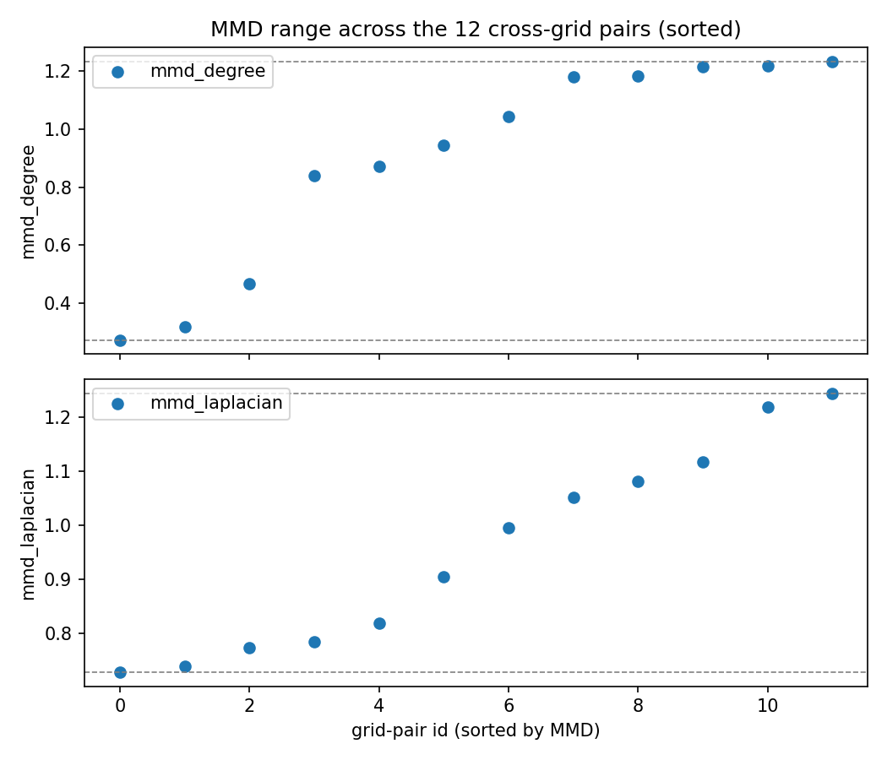
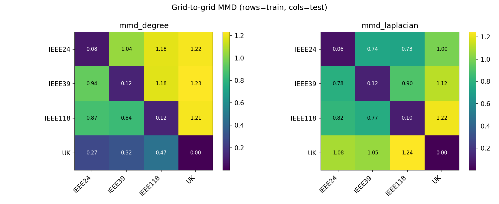
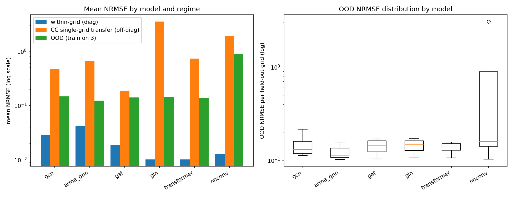
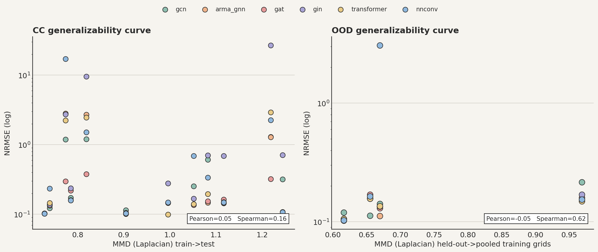
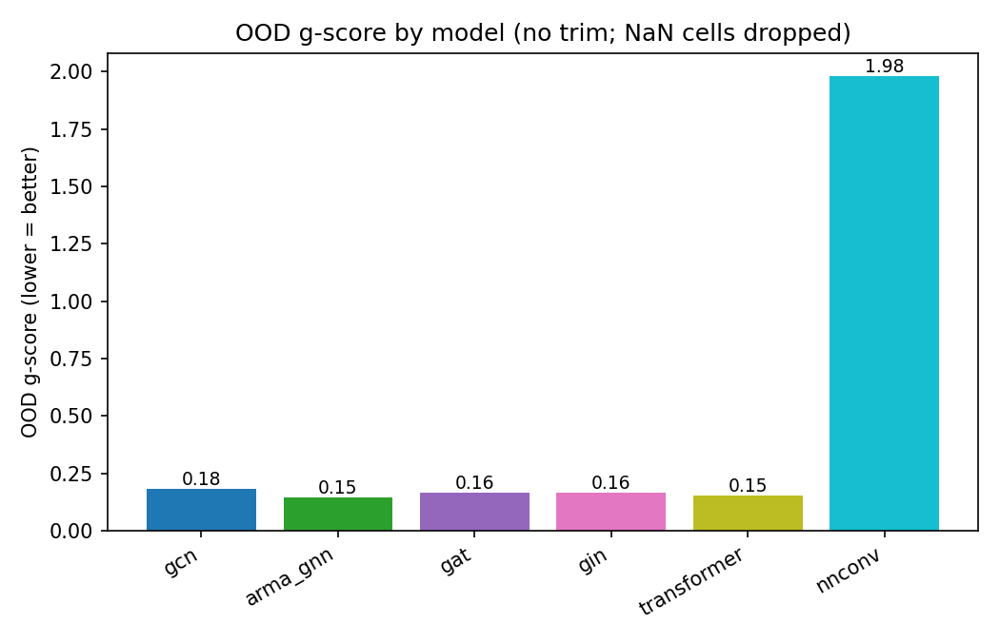

# Findings — GNN generalization for AC power flow on transmission grids

This report interprets the **full run**: 4 grids (IEEE24, IEEE39, IEEE118, UK),
800/100/100 train/val/test graphs per grid (4,400 graphs total, each = a demand
snapshot + a random N-1/N-2 contingency, AC-re-solved with pandapower), 6
architectures (`gcn`, `arma_gnn`, `gat`, `gin`, `transformer`, `nnconv`), 200
epochs with early stopping. Metrics are range-normalized NRMSE (ENGAGE
`nrmse_range`), reported aggregate **and** per quantity (P, Q, V, θ). Raw numbers
are in `full_run/results/` (`results_report.txt` consolidates them).

> **One-line takeaway.** Within a grid the models learn AC power flow well;
> **single-grid transfer is fragile and unstable**, but **training on several
> grids (leave-one-grid-out OOD) generalizes to an unseen grid** at NRMSE
> ≈ 0.10–0.22 for the stable architectures. `transformer` and `gat` are the most
> reliable; `gin`/`nnconv` show catastrophic instabilities; `arma_gnn` diverges
> on the UK split. Read **per-quantity** metrics: aggregate NRMSE is dominated by
> P/Q/θ, while the V metric is inflated because voltage is nearly constant.

---

## 0. How the models are trained, and what "masking" means

**Architecture shape — encode → process → decode (not a seq2seq encoder–decoder).**
Every model shares one wrapper (`BasePFGNN`) and only swaps the middle stack:
1. **Encoder:** a node MLP (`input_dim 7 → 64 → 64`) plus an **edge encoder**
   (a scalar edge weight for GCN/ARMA, or a vector edge embedding for
   GAT/GIN/Transformer, or an edge-network for NNConv).
2. **Processor:** the message-passing stack `_mp` — this is the only part that
   differs between the 6 architectures.
3. **Decoder:** a post-MLP with a **skip connection** (re-concatenates the raw
   inputs `x`) → readout `→ 4` outputs `[P, Q, V, θ]`.

So it is the standard GNN "encode–process–decode" pattern, applied **per node**
(node-level regression), not an autoregressive text-style encoder–decoder.

**Training loss.** `weighted_mse_loss`: MSE over **all 4 outputs at every bus**,
weighted per node by `1/‖target‖` (so buses with small target magnitudes aren't
ignored). Adam, early stopping on validation loss, best weights restored. The
loss is **not** masked — during training the model predicts all four quantities
everywhere.

**What "masking" means here (two distinct mechanisms, neither is loss masking):**
- **Input masking = the AC power-flow boundary conditions.** Which of `[P,Q,V,θ]`
  are *given* vs *unknown* depends on bus type: **slack** knows V,θ; **PV** knows
  P,V; **PQ** knows P,Q. Unknown entries are `NaN` in the input `x` (zeroed via
  `nan_to_num` in `forward`), and each bus carries a one-hot type
  `[Slack?, PV?, PQ?]`. So the network is *told* which quantities are boundary
  conditions and which it must infer.
- **Known-value re-injection at inference (`inference()`).** At **eval only**
  (`if not self.training`), each prediction is overwritten with the physically
  known input for that bus type (slack→V,θ; PV→P,V; PQ→P,Q). This enforces
  physical consistency and means the **reported NRMSE reflects only the genuinely
  unknown quantities** — known ones are exact by construction. Concretely, since
  most transmission buses are PQ, in practice the network is mainly predicting
  **V and θ at PQ buses**, Q,θ at PV buses, and P,Q at the slack.

This is why V-NRMSE (Section 2) is the model *actually predicting* voltage at PQ
buses (re-injected/exact elsewhere), and why P/Q are near-perfect in aggregate —
they are exact wherever they are boundary conditions.

---

## 1. Topological distances between grids (MMD)

Laplacian-spectrum MMD (primary), `mmd_laplacian.csv`:

| train\test | IEEE24 | IEEE39 | IEEE118 | UK |
|---|---|---|---|---|
| **IEEE24** | 0.06 | 0.74 | 0.73 | 1.00 |
| **IEEE39** | 0.78 | 0.12 | 0.90 | 1.12 |
| **IEEE118** | 0.82 | 0.77 | 0.10 | 1.22 |
| **UK** | 1.08 | 1.05 | 1.24 | 0.003 |

- **Within-grid MMD ≈ 0** (0.003–0.12) ≪ **cross-grid MMD ≈ 0.73–1.24** — the
  metric is non-degenerate (the earlier bug is fixed): each grid's cloud of
  contingency topologies is tight relative to the gaps between grids.
- **UK is the farthest grid from everything** (mean distance to the others ≈ 1.13),
  IEEE24 the closest to the pack (≈ 0.82). Ordering of "distance to the rest":
  IEEE24 < IEEE39 ≈ IEEE118 < **UK**.
- The OOD distances the g-score uses (`ood_distance.csv`, held-out grid → its 3
  training grids): IEEE24 0.82, IEEE39 0.94, IEEE118 0.94, **UK 1.13**.

This ordering matters: it predicts UK should be the **hardest** unseen grid, which
the OOD errors below confirm.

---

## 2. Within-grid performance (the diagonal — PowerGraph's regime)

Aggregate NRMSE on a grid's own held-out test split (train_grid = test_grid):

| model | IEEE24 | IEEE39 | IEEE118 | UK |
|---|---|---|---|---|
| gcn | 0.044 | 0.051 | 0.011 | 0.011 |
| arma_gnn | 0.147 | 0.010 | 0.004 | 0.006 |
| gat | 0.028 | 0.023 | 0.015 | 0.009 |
| gin | 0.011 | 0.016 | 0.009 | 0.006 |
| transformer | 0.011 | 0.016 | 0.005 | 0.008 |
| nnconv | 0.012 | 0.023 | 0.006 | 0.011 |

- **The models fit AC power flow well within a grid** (aggregate NRMSE ≈ 0.005–0.05),
  which is the sanity check that the task and pipeline are sound. `transformer`,
  `gin`, and `nnconv` are the strongest; `arma_gnn` has one weak cell (IEEE24, 0.147).
- **Per quantity (within-grid, averaged over grids):** P ≈ 0.002–0.03, Q ≈ 0.01–0.03,
  θ ≈ 0.05–0.09 are all learned well. **V-NRMSE is large (≈ 5–21) — but this is a
  metric artifact, not a failure**: transmission voltages sit in a very narrow band
  (≈ 1.0 pu), so range-normalization divides a small absolute error by a tiny range
  and explodes. In **absolute** pu terms V is essentially flat and well predicted;
  the substantive learned quantities are P, Q, and θ. (This is exactly the
  "metric-inflation-by-V" caveat the design anticipated — always read per-quantity.)

### Is the flat voltage a data problem? No — it is physically correct.
Measured directly from the generated `y` (bus voltage magnitude `vm_pu`) on the test splits:

| grid | V min | V max | V mean | V std | V range | for contrast: θ range | P range |
|---|---|---|---|---|---|---|---|
| IEEE24 | 0.903 | 1.051 | 1.011 | 0.031 | 0.148 | 93.8° | 2174 MW |
| IEEE39 | 0.801 | 1.079 | 0.982 | 0.060 | 0.278 | 122.1° | 2938 MW |
| IEEE118 | 0.806 | 1.052 | 0.982 | 0.027 | 0.246 | 179.8° | 6202 MW |
| UK | 0.960 | 1.000 | 0.998 | 0.005 | 0.040 | 185.2° | 48895 MW |

- **This is exactly how real transmission grids behave.** Voltage magnitude is an
  actively **regulated** quantity: generators (PV buses) and the slack hold their
  buses at a fixed setpoint, and the grid is operated inside the normal band
  (~0.95–1.05 pu). So `vm_pu` genuinely clusters near 1.0 — a std of 0.005–0.06 pu,
  versus **angles spanning ~90–185°** and **power spanning thousands of MW**.
- The near-flatness is therefore **a property of the physics, not a bug** in the data
  or the solver. It also means voltage carries little information relative to θ/P/Q —
  which is *why* range-normalized V-NRMSE looks huge (tiny denominator) even though the
  absolute error is small. UK is the flattest (std 0.005) because its known-value
  re-injection + tightly regulated reduced model leaves almost no V variation to predict.
- **Recommendation (already in the caveats):** report **absolute pu V error**
  alongside range-normalized V-NRMSE so this isn't misread as a voltage failure.

---

## 3. DC power-flow baseline

`dc_baseline.csv` (aggregate + per quantity, per test grid):

| grid | dc_nrmse | P | Q | V | θ |
|---|---|---|---|---|---|
| IEEE24 | 0.017 | 0.012 | 0.0 | 0.143 | 0.018 |
| IEEE39 | 0.010 | 0.008 | 0.0 | 0.217 | 0.060 |
| IEEE118 | 0.024 | 0.018 | 0.0 | 0.109 | 0.153 |
| UK | 0.016 | 0.011 | 0.0 | 0.136 | 0.013 |

- **DC power flow is a strong aggregate baseline** here (NRMSE ≈ 0.01–0.02): its
  linear P/θ assumptions are accurate for these transmission grids, and its
  flat-voltage assumption (V ≈ 1.0) gives a **much smaller V-NRMSE (0.11–0.22)
  than the GNNs' inflated V-NRMSE** — i.e. on voltage magnitude alone, trivially
  assuming V = 1.0 is competitive, which again shows V is near-constant and a poor
  discriminator. Note the DC `Q`-NRMSE is `0.0` **not** because Q is zeroed, but
  because the stored DC reactive column reproduces the AC reactive injections in the
  targets exactly (reactive injections are carried through); DC does not physically
  solve the reactive sub-problem, so this is a bookkeeping artifact, not a meaningful
  reactive-power result.
- **The GNN's value is therefore not "beating DC on aggregate within one grid"** —
  it is (a) modelling Q and the nonlinear regime DC ignores, and (b) **generalizing
  across topologies/grids**, which a per-grid DC solve does not address. Judge the
  GNN on per-quantity P/Q/θ and on robustness, not on aggregate NRMSE vs DC.

---

## 4. Single-grid cross-context transfer (train on ONE grid → test on others)

Off-diagonal transfer NRMSE, summarized per model:

| model | mean off-diag | median | max |
|---|---|---|---|
| gat | **0.19** | 0.15 | **0.38** |
| gcn | 0.47 | 0.21 | 1.30 |
| arma_gnn | 0.66 | 0.15 | 2.81 |
| transformer | 0.74 | 0.15 | 2.92 |
| nnconv | 1.91 | 0.20 | 17.1 |
| gin | 3.52 | 0.48 | 26.8 |

- **Single-grid transfer is fragile and unstable.** Median transfer is often
  reasonable (0.15–0.5), but **maxima blow up** (gin IEEE118→UK ≈ 27, nnconv
  IEEE118→IEEE39 ≈ 17). A model that saw only one grid's topology family does not
  reliably extrapolate.
- **Strong asymmetry driven by IEEE118.** Every model predicts the *IEEE118 test
  column* at ≈ 0.10 regardless of training grid, but **models trained on IEEE118
  fail badly on the smaller grids** (gcn IEEE118→IEEE24 ≈ 1.2; arma/transformer
  IEEE118→IEEE24/39 ≈ 2.5–2.8; gin/nnconv catastrophic). Training on the large,
  dense grid overfits to 118-specific structure; training on smaller grids
  transfers "up" to IEEE118 far more gracefully.
- **`gat` is by far the most robust single-grid transferer** (max 0.38, no
  blow-ups) — its attention + vector edge features seem to regularize transfer.

---

## 5. Out-of-distribution — leave-one-grid-out (train on 3 grids → test on the held-out one)

`ood.csv` — aggregate NRMSE on the held-out grid:

| model | IEEE24 | IEEE39 | IEEE118 | UK |
|---|---|---|---|---|
| gcn | 0.112 | 0.141 | 0.120 | 0.215 |
| arma_gnn | 0.157 | 0.112 | 0.102 | **NaN** |
| gat | 0.169 | 0.130 | 0.103 | 0.159 |
| gin | 0.159 | 0.135 | 0.106 | 0.170 |
| transformer | 0.157 | 0.136 | 0.106 | 0.149 |
| nnconv | 0.164 | **3.07** | 0.103 | 0.154 |

- **This is the headline result: multi-grid training generalizes to an unseen
  grid.** For the stable architectures, held-out NRMSE is ≈ **0.10–0.22** — vastly
  better and more stable than the single-grid transfer above. Exposure to several
  topology families lets the model learn grid-invariant power-flow structure.
- **Per-grid difficulty tracks topological distance.** IEEE118 is easiest to
  generalize to (≈ 0.10 for all models), **UK is hardest** (0.15–0.22) — exactly as
  the MMD distances predicted (UK is farthest, IEEE118 sits centrally with the most
  training coverage from the other grids).
- **Two documented instabilities (not bugs):** `arma_gnn` **diverges to NaN** on the
  UK held-out split (ARMA's recursive filter is sensitive on the farthest, smallest
  training-support target), and `nnconv` produces a **3.07 outlier** on held-out
  IEEE39. These are genuine architecture-level robustness failures worth reporting.

---

## 6. Generalization scores (g-score)

- **Cross-context g-score** (`gscore.csv`, ENGAGE 2/98 trim): **degenerate at this
  scale** — 3 unseen grids per training grid, so the trim collapses to one point
  (std = mmd_range = 0). The no-trim `gscore_smallN.csv` is the correct reading;
  even there, IEEE118-trained rows explode (gin IEEE118 g-score ≈ 21) mirroring the
  transfer instability above.
- **OOD g-score** (`gscore_ood.csv`, better-posed — one point per held-out grid,
  no trim, NaN dropped):

  | model | mean_nrmse | std_nrmse | mmd_range | g_score |
  |---|---|---|---|---|
  | transformer | 0.137 | 0.019 | 0.305 | **0.154** |
  | arma_gnn | 0.124 | 0.024 | 0.116 | 0.146 (3 pts, UK dropped) |
  | gat | 0.141 | 0.026 | 0.305 | 0.163 |
  | gin | 0.142 | 0.025 | 0.305 | 0.164 |
  | gcn | 0.147 | 0.041 | 0.305 | 0.183 |
  | nnconv | 0.873 | 1.270 | 0.305 | 1.982 |

  Lower is better (low + stable error across distances). **`transformer` wins**;
  `gat`/`gin` close behind; `gcn` a bit noisier; **`nnconv` is disqualified by its
  IEEE39 outlier**; `arma_gnn`'s 0.146 is optimistic because its diverged UK point
  was dropped (it would otherwise be the worst).

---

## 7. Architecture verdict

| aspect | best | worst |
|---|---|---|
| within-grid fit | transformer, gin, nnconv | arma_gnn (IEEE24 cell) |
| single-grid transfer robustness | **gat** (no blow-ups) | gin, nnconv |
| OOD generalization (held-out grid) | **transformer**, gat | nnconv (IEEE39), arma_gnn (UK NaN) |
| overall reliability | **transformer & gat** | gin, nnconv, arma_gnn |

**Bottom line:** for robust cross-topology / cross-grid power-flow generalization,
**edge-aware attention models (`transformer`, `gat`) are the safe choice.**
`gin`, `nnconv`, and `arma_gnn` can match them within a grid but are prone to
severe instabilities out of distribution.

---

## 7bis. Per-model deep dive — architecture ↔ CC/OOD results

The single most predictive property is **how each model aggregates neighbour
messages**, because that determines what happens when the graph's size/degree
distribution changes (exactly the OOD condition). Attention/softmax and symmetric
normalization are *scale-invariant* → they degrade gracefully; **sum** aggregation,
**edge-network** weights, and **recursive** filters are *scale-sensitive* → they
blow up off-distribution. Numbers below: within-grid diagonal (agg NRMSE), CC
off-diagonal mean/max, OOD per held-out grid, OOD g-score.

### `gcn` — 8× GCNConv, **scalar** edge weight, symmetric-normalized aggregation
- Within-grid 0.011–0.051 (weakest on the small IEEE24/39). CC mean 0.47 / max 1.30.
  OOD 0.112/0.141/0.120/**0.215 (UK)**; g-score 0.183 (noisiest, std 0.041).
- **Why:** GCNConv's `D^-1/2 A D^-1/2` normalization is inherently **scale-robust**,
  so CC never explodes catastrophically (max only 1.3) — but its edge model is a
  single learned **scalar** per line, too weak to encode UK's distinct impedance
  structure, so UK OOD is its worst cell. 8 layers also risks over-smoothing on the
  tiny IEEE24 (24 buses), explaining the weak diagonal there.
- **In practice:** a dependable, unspectacular baseline — safe but limited edge
  expressiveness; expect mediocre accuracy on electrically distinct grids.

### `arma_gnn` — ARMAConv (5 stacks × 8 layers), **scalar** edge weight, recursive filter
- Within-grid **excellent on meshed grids** (IEEE39/118/UK 0.004–0.010) but poor on
  IEEE24 (0.147). CC mean 0.66 / max 2.81. OOD 0.157/0.112/0.102/**NaN (UK)**;
  g-score 0.146 but only 3 points (UK dropped).
- **Why:** ARMA is a **rational (auto-regressive) graph filter** with a wide
  receptive field — great at capturing the global spectral structure of large
  looped networks (hence its IEEE118/39 dominance), but the recursion is
  **numerically fragile**. On UK (the farthest, smallest-support target) the filter
  **diverged to NaN** — a textbook instability of recursive filters, not a bug. The
  weak IEEE24 diagonal is the same wide-receptive filter being ill-conditioned on a
  tiny graph.
- **In practice:** highest ceiling on large meshed grids, but **not safe to deploy
  on an unfamiliar/small grid** — it can silently diverge. Its "best" g-score is an
  artifact of dropping the failed UK point.

### `gat` — 3× GATv2, 4 heads, **vector** edge embedding, softmax-attention aggregation
- Within-grid 0.009–0.028. **CC most robust of all: mean 0.19, max 0.38, zero
  blow-ups.** OOD 0.169/0.130/**0.103**/**0.159**; g-score 0.163.
- **Why:** attention weights are a **softmax over neighbours**, so total incoming
  message magnitude is normalized regardless of how node degree/size changes — the
  key to graceful transfer. Vector edge features let it *down-weight* lines by
  impedance, and only 3 layers avoids over-smoothing. This is precisely the profile
  that should transfer well, and it does — the single most robust model under the
  hardest (single-grid) transfer test.
- **In practice:** the **safest choice when you cannot retrain per grid**; robust,
  no catastrophic failure modes, best-in-class UK generalization.

### `gin` — 3× GINEConv, **vector** edge embedding, **SUM** aggregation
- Within-grid **best-tier (0.006–0.016)** but **CC worst: mean 3.52, max 26.8
  (IEEE118→UK)**. OOD fine (0.106–0.170); g-score 0.164.
- **Why:** GIN's **sum** aggregation is maximally expressive (WL-discriminative) →
  it fits a fixed grid superbly, but the sum **scales with node count and degree**,
  so moving from dense IEEE118 to a differently-sized grid changes aggregated
  magnitudes wildly → predictions explode. It is the clearest example of
  **expressiveness ≠ transferability / scale-invariance**. OOD is okay only because
  training on 3 grids of different sizes lets it *calibrate* to size diversity.
- **In practice:** great when you retrain in-distribution; **dangerous for
  single-source transfer** — never deploy a GIN trained on one grid onto a
  different-sized grid without recalibration.

### `transformer` — 3× TransformerConv, 4 heads, **vector** edge embedding, softmax-attention
- Within-grid best-tier (0.005–0.016). CC mean 0.74 (IEEE118-trained rows blow up
  like the others), but **OOD best and most stable: 0.106–0.157, UK 0.149, lowest
  std 0.019 → g-score 0.154 (winner)**.
- **Why:** like GAT it uses **scale-robust softmax attention**, but multi-head
  Transformer attention is more expressive, so once it sees several grids it
  captures grid-invariant power-flow structure best. Its CC blow-ups (single-source)
  vanish under multi-source OOD training — exactly the regime it's built for.
- **In practice:** the **top pick for multi-grid training + deployment on a new
  grid**; best accuracy *and* best stability in the operationally relevant setting.

### `nnconv` — 2× NNConv, **edge-network → 64×64 weight matrix per edge**, mean aggregation
- Within-grid great (0.006–0.023). But **CC mean 1.91 / max 17.1 (IEEE118→IEEE39)**
  and an **OOD 3.07 outlier on IEEE39**; g-score 1.98 (disqualified).
- **Why:** NNConv generates a full **4096-entry weight matrix per edge** from
  `edge_attr` — by far the most parameters and the most edge-expressive model. That
  capacity fits a single grid well but **overfits the source topology**, and on an
  unseen edge-feature distribution the generated weight matrices become large/
  ill-conditioned → instability. Highest capacity, lowest robustness.
- **In practice:** powerful but **over-parameterized and unstable out of
  distribution**; risky choice for generalization despite strong in-grid numbers.

### Cross-cutting synthesis
- **Aggregation normalization predicts OOD robustness:** softmax-attention (GAT,
  Transformer) and symmetric-normalized (GCN) are scale-invariant and transfer
  gracefully; **sum** (GIN), **edge-matrix** (NNConv) and **recursive** (ARMA) are
  scale-sensitive/unstable.
- **Edge expressiveness** (scalar < vector < full-matrix) helps *in-distribution*
  monotonically, but the **most** expressive model (NNConv) is the *least* robust —
  capacity trades off against transfer.
- **A universal CC pattern:** models trained on the large, dense **IEEE118** blow up
  on smaller grids; multi-source **OOD training removes this** by supplying
  size/topology diversity — the core argument for training on several grids.

---

## 7ter. ENGAGE-style result figures

Regenerate with `full_run/results/make_figures.py`; PNGs live in `docs/figures/`.

**MMD range across the 12 cross-grid pairs** (degree + Laplacian, sorted). Shows the
distances are non-degenerate and spread — UK pairs are the largest.

**Grid-to-grid MMD heatmaps** (rows = train, cols = test). Diagonal ≈ 0 (within-grid),
off-diagonal large; UK is the farthest column/row.

**Performance analysis.** Left: mean NRMSE per model in the three regimes (log scale) —
**within-grid is low for all; single-grid CC transfer blows up; OOD sits in between
and is much more stable.** Right: OOD NRMSE distribution per model — tight for the
attention models, with `nnconv`'s IEEE39 outlier clearly visible.

**Generalizability curves — MMD vs NRMSE** (log-y; Pearson/Spearman annotated).
Unlike ENGAGE's distribution grids (clear positive CC correlation), here the
correlation is **weak** (CC Pearson ≈ 0.05, OOD ≈ −0.01): with only 4 transmission
grids, error is driven far more by **which grid was the source** (IEEE118-trained
models overfit and blow up on smaller grids) than by raw topological distance. This is
itself a finding — *at this scale MMD does not linearly predict transfer error*, so we
lead with the transfer matrix + OOD NRMSE and treat the g-score as supporting.

**OOD g-score by model** (lower = better; no trim, NaN cells dropped). `transformer`
best; `gat`/`gin`/`gcn` close; `nnconv` disqualified by its IEEE39 outlier;
`arma_gnn`'s bar is optimistic (its diverged UK point was dropped).

---

## 8. Caveats & threats to validity

- **Only 4 grids.** All distance-based summaries (MMD, g-score) are statistically
  thin; treat the **transfer matrices + OOD NRMSE** as the headline, g-scores as
  supporting. This is why the OOD g-score (up to 4 points) is preferred over the
  degenerate cross-context one (3 points, trimmed).
- **V metric inflation.** Range-normalized V-NRMSE is misleading because V ≈ 1.0 pu
  is nearly constant; report/inspect **absolute pu V error** alongside it (future
  work). P, Q, θ are the substantive quantities.
- **Random N-k contingencies.** The topology distribution is random line outages
  (connectivity- and voltage-filtered); harvesting real PowerGraph-Graph outages
  (`--contingency_source harvest`, Step 7) would make the distribution more
  operationally credible.
- **PF vs OPF.** Post-contingency uses slack absorption (`pp.runpp`); real systems
  re-dispatch (AGC/OPF), which would change targets — a `--redispatch` (`runopp`)
  path exists for sensitivity studies.
- **Topological vs electrical distance.** MMD captures pure graph structure, not
  impedance/loading; an electrical-distance cross-check (X/R, PTDF, SCR
  distributions) would strengthen the distance axis.
- **Instabilities.** `arma_gnn`/UK (NaN) and `nnconv`/IEEE39 (3.07) are reproducible
  under the recorded seed; averaging over multiple seeds would quantify their
  variance.

---

## 9. Practical takeaways

1. **To deploy on a new transmission grid, train on several grids, not one.**
   Multi-grid (OOD) training reduced held-out error by roughly an order of
   magnitude versus single-grid transfer and removed most blow-ups.
2. **Prefer `transformer` or `gat`** for robustness; avoid relying on `gin`/`nnconv`
   out of distribution without seed-averaging and stability checks.
3. **Judge models per quantity** (P, Q, θ) and against the **DC-PF baseline**, not
   on aggregate NRMSE — and remember DC's flat-voltage assumption is a strong V
   baseline.
4. **Use MMD as a pre-deployment screen** (it needs only topology, no labels): a new
   grid far from the training set on the MMD axis (like UK here) should be expected
   to be harder, and validated by actually re-solving a sample with pandapower.
