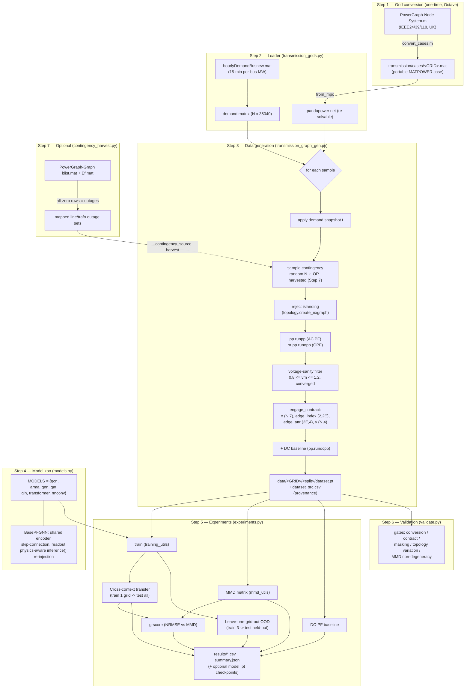

# Pipeline Report — GNN Generalization for Transmission-Grid AC Power Flow

This report documents the **implemented** pipeline in this repository end-to-end:
the flow of data, the technical grounding of every stage, how each file is
implemented and connects to the others, and a step-by-step guide to running the
experiments — including how to run a **single grid** or a **single GNN
architecture**.

It is a companion to:
- `docs/Layer2_implementation_plan.md` — the plan and the *why* per step.
- `docs/PowerGraph_to_ENGAGE_design_decisions.md` — the design decisions (D1–D12).
- `docs/Experimental_Design_transmission_GNN_generalization.md` — research
  questions, experimental setup, methodology, threats to validity.

---

## 1. What the pipeline does (one paragraph)

For each transmission grid (IEEE24, IEEE39, IEEE118, UK) we take PowerGraph's
source grid model (`System.m`) and its real per-bus hourly demand, turn the grid
into a **distribution of topologies** by sampling credible N-1/N-k line
contingencies, **re-solve the AC power flow** for every (demand, topology) pair
with pandapower, and emit ENGAGE-format graph samples. We then train six GNN
architectures under one interface and measure how they **generalize to unseen
topologies and unseen grids** (cross-context transfer + leave-one-grid-out),
reporting per-quantity errors (P, Q, V, θ), a DC-power-flow baseline, and a
topological-distance-aware g-score (NRMSE vs. MMD).

---

## 2. Flow diagram


```mermaid
flowchart TD
    subgraph S1["Step 1 — Grid conversion (one-time, Octave)"]
        A1["PowerGraph-Node System.m<br/>(IEEE24/39/118, UK)"] -->|convert_cases.m| A2["transmission/cases/&lt;GRID&gt;.mat<br/>(portable MATPOWER case)"]
    end

    subgraph S2["Step 2 — Loader (transmission_grids.py)"]
        A2 -->|from_mpc| B1["pandapower net (re-solvable)"]
        A3["hourlyDemandBusnew.mat<br/>(15-min per-bus MW)"] --> B2["demand matrix (N x 35040)"]
    end

    subgraph S3["Step 3 — Data generation (transmission_graph_gen.py)"]
        B1 --> C1{"for each sample"}
        B2 --> C1
        C1 --> C2["apply demand snapshot t"]
        C2 --> C3["sample contingency<br/>random N-k  OR  harvested (Step 7)"]
        C3 --> C4["reject islanding<br/>(topology.create_nxgraph)"]
        C4 --> C5["pp.runpp (AC PF)<br/>or pp.runopp (OPF)"]
        C5 --> C6["voltage-sanity filter<br/>0.8 <= vm <= 1.2, converged"]
        C6 --> C7["engage_contract:<br/>x (N,7), edge_index (2,2E),<br/>edge_attr (2E,4), y (N,4)"]
        C7 --> C8["+ DC baseline (pp.rundcpp)"]
        C8 --> C9["data/&lt;GRID&gt;/&lt;split&gt;/dataset.pt<br/>+ dataset_src.csv (provenance)"]
    end

    subgraph S4["Step 4 — Model zoo (models.py)"]
        D1["MODELS = {gcn, arma_gnn, gat,<br/>gin, transformer, nnconv}"]
        D2["BasePFGNN: shared encoder,<br/>skip-connection, readout,<br/>physics-aware inference() re-injection"]
        D1 --- D2
    end

    subgraph S5["Step 5 — Experiments (experiments.py)"]
        C9 --> E1["train (training_utils)"]
        D1 --> E1
        E1 --> E2["Cross-context transfer<br/>(train 1 grid -> test all)"]
        E1 --> E3["Leave-one-grid-out OOD<br/>(train 3 -> test held-out)"]
        C9 --> E4["MMD matrix (mmd_utils)"]
        C9 --> E5["DC-PF baseline"]
        E2 --> E6["g-score (NRMSE vs MMD)"]
        E4 --> E6
        E2 --> E7["results/*.csv + summary.json<br/>(+ optional model .pt checkpoints)"]
        E3 --> E7
        E4 --> E7
        E5 --> E7
        E6 --> E7
    end

    subgraph S6["Step 6 — Validation (validate.py)"]
        C9 --> F1["gates: conversion / contract /<br/>masking / topology variation /<br/>MMD non-degeneracy"]
    end

    subgraph S7["Step 7 — Optional (contingency_harvest.py)"]
        G1["PowerGraph-Graph blist.mat + Ef.mat"] -->|all-zero rows = outages| G2["mapped line/trafo outage sets"]
        G2 -.->|--contingency_source harvest| C3
    end
```

---

## 3. Technical grounding

### 3.1 Why regenerate rather than reuse PowerGraph's tensors
AC power flow is deterministic physics: an outage changes the admittance matrix
and therefore the solution at **every** bus. PowerGraph-Node's published tensors
are a *single fixed topology* per grid (only demand varies), so they cannot
supply the **topology distribution** that MMD and the g-score need. We therefore
replicate PowerGraph's `gendataopf.m` idea (load model → set demand → solve) in
Python, and add topology perturbation + re-solve.

### 3.2 Solver: pandapower
- `pp.runpp` — Newton-Raphson AC power flow (default post-contingency solve;
  generator setpoints held, slack absorbs mismatch).
- `pp.runopp` — AC optimal power flow (optional `--redispatch`, re-optimizes
  generation; heavier, needs cost data).
- `pp.rundcpp` — DC power flow (the baseline stored per sample).
- MATPOWER `System.m` cases are imported through
  `pandapower.converter.matpower.from_mpc.from_mpc`.
Chosen because the whole loop (perturb → solve → build graph → train) stays in
one Python/PyTorch runtime, and ENGAGE already uses pandapower.

### 3.3 Graph contract (ENGAGE), per node/edge
```
x          : (N, 7)  [Slack?, PV?, PQ?, p_mw, q_mvar, vm_pu, va_degree]
edge_index : (2, 2E) undirected (both directions), in-service branches only
edge_attr  : (2E, 4) [transformer?, r_pu, x_pu, sc_voltage]
y          : (N, 4)  [p_mw, q_mvar, vm_pu, va_degree]   (full solved state)
dc_pf      : (N, 4)  DC power-flow baseline
```
**Masking (physics of the PF problem).** Inputs unknown at inference are NaN by
bus type: slack → P,Q unknown; PV → Q,θ unknown; PQ → V,θ unknown. Targets `y`
never contain NaN. Models replace input NaNs with 0 (`nan_to_num`) and, at test
time, overwrite the known outputs again via `inference()` re-injection.

**Contingency-awareness.** `get_edge_features` includes only `in_service`
branches, so an N-k outage genuinely changes `edge_index`/`2E` — that variation
is exactly what makes the topological distance meaningful.

### 3.4a Representation: per-unit, then a training-only z-score
`--normalize pu_zscore` (`normalization.py`) is the protocol for every final
result. Powers are divided by `S_base = 100 MVA` and angles converted to radians,
then each of the four quantities is centred and scaled by statistics **fitted on
training data only** — the training grid's split for within-grid and
cross-context, the pooled retained grids for an OOD fold, never the unseen grid.
Features and targets share the scaler because `inference()` re-injects known
values taken from `x` into the prediction, so the two must live in the same space.
Predictions are de-normalized before any metric is computed, and the DC baseline
is never scaled. `--normalize none` is the raw-unit ablation and reproduces the
pre-A2 artifacts bit-identically. Per-unit alone is a no-op here (all four cases
have `sn_mva = 100`); the z-score is what fixes the real defect, voltage magnitude
contributing ~5e-8 of the training loss. See `docs/Normalization_assessment.md`.

### 3.4 Topological distance: MMD done correctly
Per grid we build a **distribution** of fixed-length graph descriptors
(degree histogram; normalized-Laplacian-spectrum histogram over [0,2] so grids of
different size are comparable), and compute a Gaussian-kernel MMD with the
**median-heuristic bandwidth**. This fixes the earlier degeneracy (one descriptor
per grid + a saturated fixed bandwidth produced a constant √2). Refs: Gretton et
al. 2012; ggme (O'Bray et al.).

Two details that must be quoted with any number: the estimator is the **biased
V-statistic** by default (`mmd(..., unbiased=True)` gives the U-statistic, which is
why a same-grid MMD is small-but-nonzero rather than exactly zero), and the median
bandwidth is recomputed **per pair**, so a value is a distance within its own
comparison and not on a global scale. Degree and Laplacian descriptors are purely
topological and cannot see an electrical change, so
`mmd_utils.reactance_histogram` adds a `log10(x_pu)` branch-reactance descriptor as
the electrical complement (`docs/Generalization_score_and_MMD.md`).

### 3.5 Metrics
- **Aggregate NRMSE** normalized by the average per-dimension range (ENGAGE).
- **Per-quantity NRMSE** (P, Q, V, θ) — because V is tightly bounded, aggregate
  NRMSE is flattered by V; angles/reactive power are the hard quantities.
- **DC-PF baseline** for every test grid — the GNN must beat trivial physics.
  Reported under two conventions: `dc_nrmse` with **Q ≡ 0** over all four
  quantities (primary; matches ENGAGE's Table 3) and `nrmse_PVtheta` over the
  quantities DC actually solves (secondary). Q is zeroed at generation *and* at
  scoring, because `rundcpp` does not write `res_bus.q_mvar` and on pandapower 3.x
  the pre-existing AC value survives (audit item A1).
- **Physics-aware reporting** (`physics_metrics.py`, replayed from checkpoints by
  `eval_checkpoints.py`): per-quantity error restricted to the entries the model
  genuinely predicts — two of four columns per bus are re-injected ground truth —
  plus p95/p99/max tails and voltage-limit violation, false-secure and false-alarm
  rates. This, not the pooled aggregate, is the headline reporting layer.
- **g-score** = `mean_nrmse + alpha * std_nrmse * log(mmd_range+1)/(mmd_range+eps)`.
  Two flavours are produced:
  - **Cross-context g-score** (`gscore.csv`), computed *per training grid* over its
    unseen TEST grids (3 points each). NOTE: the default `bounds=2` percentile trim
    assumes many samples; with only 3 points it collapses (std=0, range=0), so the
    pooled no-trim variant `gscore_cc_aggregate.csv` is the appropriate reading.
    (The exploratory run's `full_run/results/gscore_smallN.csv` was the earlier
    form of that variant; the current pipeline does not emit it.)
  - **OOD g-score** (`gscore_ood.csv`), computed *per model* over the held-out
    grids (one point per grid → up to 4 points), where the topological distance is
    the **pooled** Laplacian-MMD from each held-out grid to the **mixture** of its
    TRAINING grids — i.e. the three training grids are pooled into one distribution
    and a single `MMD(held, A∪B∪C)` is computed, matching ENGAGE's `evaluate_cc_mmd`
    (NOT a mean of pairwise MMDs; see design decision D14). This is the
    **better-posed** g-score at small N (no trim; NaN cells dropped) and the
    one most aligned with "generalization to a new grid after training on several."
    The explicit distances it uses are written to **`ood_distance.csv`** (per
    held-out grid: pooled degree + Laplacian MMD to the training mixture) so the
    g-score's x-axis is visible without back-computing it from the pairwise matrix.

---

## 4. File-by-file: what it implements and how it connects

| File | Step | Role | Key functions / classes | Consumes | Produces |
|------|------|------|--------------------------|----------|----------|
| `transmission/convert_cases.m` | 1 | Octave: `System.m` → portable `.mat` | `convert_cases` | `System.m` | `transmission/cases/<GRID>.mat` |
| `transmission_grids.py` | 2 | Load case + demand into pandapower | `get_transmission_grid_codes`, `load_case`, `load_hourly_demand` | `.mat`, `hourlyDemandBusnew.mat` | pandapower `net`, demand array |
| `engage_contract.py` | 3 | ENGAGE feature/label extractors (contingency-aware) | `get_node_features`, `get_edge_features` | solved `net` | `x, y, edge_index, edge_attr` |
| `contingency_harvest.py` | 7 | Read PowerGraph-Graph outages, map to elements | `harvest_contingencies`, `map_all_contingencies` | `blist.mat`, `Ef.mat` | list of outage element-sets |
| `transmission_graph_gen.py` | 3 | The re-solve engine (demand + outage → `runpp` → filter → `Data`) | `generate_dataset`, `_build_sample`, `_apply_*_contingency` | Steps 2/3/7 | `data/<GRID>/<split>/dataset.pt` |
| `models.py` | 4 | Six edge-aware GNNs behind one interface | `BasePFGNN`, `GCN`, `ARMA_GNN`, `GAT`, `GIN`, `TRANSFORMER`, `NN_CONV`, `MODELS` | `Data` batch | `pred (N,4)` |
| `training_utils.py` | 5 | Training loop + metrics + DC baseline | `train`, `evaluate`, `nrmse_range`, `nrmse_per_quantity`, `test_dc_pf`, `get_generalization_score` | datasets + models | trained model, metrics |
| `mmd_utils.py` | 5 | Distribution-based MMD | `evaluate_mmd`, `mmd`, `*_histogram` | two datasets | (mmd_degree, mmd_laplacian) |
| `experiments.py` | 5 | Orchestrator: CC + OOD + MMD + DC + g-score | `run_cross_context`, `run_ood`, `compute_gscores`, `compute_ood_gscores`, `ood_distances`, `dc_baseline` | datasets + `MODELS` | `results/*.csv`, `.pt` checkpoints |
| `validate.py` | 6 | Correctness gates | gate A–E, `gate_split_hygiene` (H) | cases + datasets | pass/fail report |
| `normalization.py` | 5 | Feature/target scaling behind one flag | `Scaler.fit/transform/inverse_targets`, `MODES` | training split | scaler + scaled datasets |
| `physics_metrics.py` | 5 | Physics-aware reporting layer | `predicted_mask`, `predicted_only_metrics`, `error_tails`, `violation_rates` | preds + truth (physical units) | per-quantity + violation metrics |
| `eval_checkpoints.py` | 5 | Replay saved weights without retraining | `_scaler_for`, walk of `ckpt_norm/` | checkpoints + datasets | `results_norm/physics/physics_metrics.csv` |
| `checkpoint_index.py` | 6 | Map every results row to a weight file | `parse_name`, `sha256`, `n_params` | `ckpt_norm/` | `docs/tables/checkpoint_index.csv` |
| `mmd_report.py` | 6 | Grid-distance tables, biased + unbiased | — | dataset dir | `docs/tables/mmd_*.csv` |

**Connection summary.** Step 1 is a one-time conversion (outputs are committed).
Step 2 is the only place that touches PowerGraph files. Step 3 is the heart: it
calls Step 2 to get the base net + demand, optionally Step 7 for real outage
sets, uses `engage_contract` to build each graph, and writes the ENGAGE dataset
layout. Steps 4–5 are grid-agnostic: `experiments.py` just iterates `MODELS`
over the datasets, trains via `training_utils`, measures distance via
`mmd_utils`, and writes CSVs. Step 6 validates the Step-3 output.

---

## 5. Model architectures (Step 4 detail)

All models subclass `BasePFGNN`, which provides a node pre-encoder
(`input_dim→64→64`), a post-processor with a **skip connection** concatenating the
raw inputs, a readout to 4 targets, and the shared `inference()` known-value
re-injection. Each subclass only implements the message-passing stack `_mp`:

| Model | Conv | Edge handling | Depth (frozen) |
|-------|------|---------------|---------------|
| `gcn` | `GCNConv` | learned **scalar** edge weight from `edge_attr` | 2 |
| `arma_gnn` | `ARMAConv` (Hansen et al. 2023) | scalar edge weight, **softplus** so it stays positive | 8 (5 stacks) |
| `gat` | `GATv2Conv` | **vector** edge embedding via `edge_dim` | 2 (4 heads) |
| `gin` | `GINEConv` | vector edge embedding (added inside conv) | 3 |
| `transformer` | `TransformerConv` | vector edge embedding via `edge_dim` | 2 (4 heads) |
| `nnconv` | `NNConv` | **edge network** → HIDDEN×HIDDEN weight matrix | 2 |

Depths and widths above are the **tuned, frozen** values in
`configs/arch_config.json` (all at hidden = 128, lr = 1e-3); selection evidence and
parameter counts are in `docs/Model_configurations.md`. ARMA's softplus is not
cosmetic — a negative learned edge weight makes `ARMAConv`'s symmetric
normalization take the square root of a negative number and the run diverges
(Decision 16).

---

## 6. Step-by-step: running the experiments

### 6.1 Prerequisites
```bash
git clone https://github.com/Davjes15/eval_gnn_generalization_pg.git
git clone https://github.com/PowerGraph-Datasets/PowerGraph-Node.git
cd eval_gnn_generalization_pg
git checkout step-8-regime-comparison           # latest code (steps 1–9 + audit remediation)
pip install -r requirements.txt
export POWERGRAPH_NODE_DIR="$(pwd)/../PowerGraph-Node/13_Power_system"
```
GPU is used automatically for training/eval if `torch.cuda.is_available()`
(`get_device()` → `cuda:0`). Data generation is CPU-only (pandapower solves).

### 6.2 Generate the datasets
The benchmark uses two: a fixed-topology control arm and a varying-topology
transfer arm, and they are generated with different protocols.
```bash
# Regime A -- fixed topology, one demand snapshot per sample
python3 transmission_graph_gen.py --grid all --max_k 0 --unique_demand \
    --n_train 800 --n_val 100 --n_test 100 --out_dir data_a

# Regime B -- N-1/N-2 contingencies, disjoint blocked demand windows (A5)
python3 transmission_graph_gen.py --grid all --max_k 2 --time_split blocked \
    --n_train 800 --n_val 100 --n_test 100 --out_dir data_full_v2
```

### 6.3 Validate (required before training)
```bash
python3 validate.py --data_dir data_a
python3 validate.py --data_dir data_full_v2 --expect_blocked   # gate H: split hygiene
```

### 6.4 Run the experiments
The final normalized campaign is one command — 18 independent jobs (6
architectures x 3 arms) through a bounded process pool, each with
`OMP_NUM_THREADS=1`, `--normalize pu_zscore`, `--save_models` and
`--skip_existing` so an interrupted campaign resumes:
```bash
bash launch_normalized.sh 7 within cross ood     # 7 = pool size
```
or a single arm by hand:
```bash
python3 experiments.py --experiment both --data_dir data_full_v2 --out results \
    --epochs 200 --normalize pu_zscore --arch_config configs/arch_config.json \
    --seeds 0 100 300 700 1000 --save_models models
```
Then replay the saved weights for the physics-aware report, without retraining:
```bash
python3 eval_checkpoints.py --ckpt_root ckpt_norm --data_a data_a \
    --data_b data_full_v2 --normalize pu_zscore --out results_norm/physics
python3 checkpoint_index.py --ckpt_root ckpt_norm --out docs/tables/checkpoint_index.csv
```
The campaign runs with `--skip_mmd`, so the model-independent tables (MMD
matrices, pooled OOD distances, DC baseline) are computed once for the whole
campaign instead of 18 times in parallel with the training:
```bash
python3 experiments.py --only_topology --experiment ood --data_dir data_full_v2 \
    --out results_norm/topology --regime_tag B --models gcn \
    --arch_config configs/arch_config.json
```
The merge / ranking / table chain that consumes all of this is one block in
`docs/Reproducibility.md` §5.
Outputs in `results/`: `cross_context.csv`, `ood.csv`, `transfer_matrix_<model>.csv`,
`mmd_degree.csv`, `mmd_laplacian.csv`, `dc_baseline.csv`, `gscore.csv` (cross-context),
`ood_distance.csv` (held-out→train distances), `gscore_ood.csv` (OOD, better-posed at
small N), `summary.json`.
Checkpoints are named `within_<model>_<grid>_s<seed>.pt`,
`cc_<model>_<train_grid>_s<seed>.pt` and
`ood_<model>_heldout_<grid>_s<seed>.pt`; `checkpoint_index.py` parses exactly
these three forms and refuses anything else rather than guessing an arm.

---

## 7. Running only ONE grid or ONE architecture

Both `transmission_graph_gen.py` and `experiments.py` accept subset flags, so you
never need to run everything.

**Only one grid (generation + experiments):**
```bash
# generate just IEEE39
python3 transmission_graph_gen.py --grid IEEE39 --n_train 800 --n_val 100 --n_test 100 --out_dir data

# experiments restricted to one grid (note: cross-grid transfer needs >1 grid;
# a single grid gives you the within-grid diagonal only)
python3 experiments.py --experiment cross --grids IEEE39 --data_dir data --out results
```

**A subset of grids (so transfer is meaningful):**
```bash
python3 experiments.py --experiment both --grids IEEE24 IEEE39 --data_dir data --out results
```

**Only one architecture:**
```bash
python3 experiments.py --experiment both --models gat --data_dir data --out results --save_models models
```

**One architecture on one pair of grids, quick (few epochs):**
```bash
python3 experiments.py --experiment cross --models gcn --grids IEEE24 IEEE39 \
    --epochs 20 --data_dir data --out results
```

**Load a saved checkpoint later:**
```python
import json, torch
from models import MODELS
cfg = json.load(open("configs/arch_config.json"))["configs"]["gat"]
m = MODELS["gat"](input_dim=7, hidden=cfg["hidden"], num_layers=cfg["num_layers"])
m.load_state_dict(torch.load("ckpt_norm/cross_gat/cc_gat_IEEE39_s0.pt",
                             map_location="cpu", weights_only=True))
m.eval()
```
The frozen configuration must be passed, because a checkpoint only fits the
width/depth it was trained at — which is why `eval_checkpoints.py` reads
`configs/arch_config.json` rather than using constructor defaults. It also has to
re-fit the same training-only scaler before the numbers mean anything; use it
instead of hand-loading unless you are doing something bespoke.

Relevant CLI flags:
- `transmission_graph_gen.py`: `--grid {all|IEEE24|IEEE39|IEEE118|UK}`, `--n_train/--n_val/--n_test`,
  `--max_k`, `--redispatch`, `--seed`, `--contingency_source {random,harvest}`, `--pg_graph_raw`,
  `--unique_demand`, `--time_split {random,blocked}`, `--time_gap`.
- `experiments.py`: `--experiment {cross,ood,both,within}`, `--grids ...`, `--models ...`,
  `--epochs`, `--seeds ...`, `--data_dir`, `--out`, `--save_models <dir>`,
  `--normalize {none,pu,pu_zscore}`, `--arch_config`, `--regime_tag`,
  `--batch_size` / `--batch_size_ood`, `--skip_existing`.
- `validate.py`: `--data_dir`, `--expect_blocked`.

---

## 8. Known caveats (observed in the full run)
- `arma_gnn` OOD held-out UK produced NaN in the **inherited-config run**, which
  turned out to be the negative-edge-weight bug, not an intrinsic instability;
  fixed in Decision 16 and no longer observed. Kept here because the superseded
  tables in `full_run/results/` still show it.
- `gin`/`nnconv`/`transformer` transfer *from* IEEE118 to small grids is unstable
  (large NRMSE) — expected for out-of-distribution structural transfer.
- Per-quantity V/θ NRMSE can exceed 1 because V has a tiny physical range; read
  P/Q/θ alongside V rather than the aggregate alone. Under `--normalize none` this
  was not only a reading hazard but a training defect — V carried ~5e-8 of the
  loss, so every architecture lost to the constant `V ≡ 1.0` in-distribution. The
  `pu_zscore` protocol is what removes it (audit item A2).
- Two of the four target columns per bus are re-injected ground truth, so the
  four-column aggregate partly scores the inputs. Use the predicted-entry-only
  columns from `eval_checkpoints.py` for any statement about model quality.
- The **cross-context** g-score is statistically under-powered at only 4 grids
  (3 points/training grid); use `gscore_cc_aggregate.csv` for it. The **OOD** g-score
  (`gscore_ood.csv`, up to 4 points/model, no trim) is better-posed and is the
  more meaningful generalization measure; still treat the transfer matrix + MMD
  as the headline given N=4. Stronger statement since A6: with one dataset per arm
  the MMD range is a shared constant, so the g-score reduces to `μ + cσ` and
  cannot reorder architectures through distance at all — report `μ` and `σ`, and
  read the g-score as a risk-averse summary (`docs/Generalization_score_and_MMD.md`).
