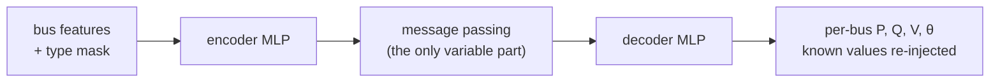

# 5-Minute Talk — GNN Generalization for AC Power Flow on Transmission Grids

Provenance: this deck describes the **final normalized campaign** (`--normalize
pu_zscore`, 336 checkpoints, results in `results_norm/`). The authoritative
document is [`Normalization_results.md`](Normalization_results.md) **section 4**;
the limitations quoted here are L1–L7 of
[`Audit_response.md`](Audit_response.md). Every number below carries the CSV it
comes from — if a number here disagrees with `results_norm/`, `results_norm/`
wins and this file is stale. The earlier raw-unit campaign (`results/`) is kept
as a documented ablation and none of its numbers appear here.

A slide-ready script for a technical audience (~750 words ≈ 5 min). Each **beat**
is roughly one slide.

---

## Beat 1 — The hook: problem → gap → question (45s)
> **The problem.** The field is racing toward **Grid Foundation Models** — one large,
> pre-trained graph neural network meant to serve *any* grid and *any* task, from
> power flow to contingency screening (IBM's *GridFM*, Microsoft's *GridSFM* trained
> on 200 grids). The entire promise rests on a single assumption: that a GNN trained
> on some grids **transfers to grids and topologies it has never seen**. Because the
> grid is a graph that *constantly changes* — lines trip, topologies reconfigure — a
> model that only works on its training grid is useless for operations.
>
> **The research gap.** That assumption is usually *asserted*, not *measured*. Papers
> say "GNNs generalize" and scale up — but we lack controlled evidence for **which**
> graph architectures actually transfer, by **how much**, against **what baseline**,
> and **how to even measure** distance between grids of different sizes.
>
> **The research question.** *Does within-grid accuracy tell you anything about
> behaviour on a harder protocol or an unseen system — and is a trained surrogate
> the right tool there at all?* We answer it on a task whose ground truth is exact,
> **AC power flow**, so any failure to generalize is unambiguous.

## Beat 2 — The setup / methodology (45s)
> Why learn a surrogate at all, if power flow is exact? **Amortization** — a solver
> re-runs from scratch for every scenario, a trained GNN answers instantly, which is
> what makes screening thousands of topologies feasible. Four transmission grids —
> IEEE 24, 39, 118-bus and the UK 29-bus system. Each grid is a *distribution*: we
> sample demand snapshots and random **N-1/N-2 line outages**, then re-solve AC power
> flow for ground truth — 800/100/100 graphs per grid, **4,000 total**. Every bus
> predicts **P, Q, V, θ**. Six architectures — GCN, ARMA, GAT, GIN, TransformerConv,
> NNConv — one identical recipe, 200 epochs, seeds 0/100/300/700/1000 (NNConv 3
> seeds: 0/100/300, a compute trade-off, limitation L2). A **DC power-flow**
> baseline is scored through the same code path. Three arms: fixed topology
> (Regime A, `data_a`), same grid under a blocked temporal split with contingencies
> (Regime B, `data_full_v2`), and leave-one-grid-out on an unseen system.

## Beat 3 — How the model works (45s)
> Same skeleton for all six: **encode → process → decode**, per node. An MLP encodes
> each bus, a message-passing block — the only part that differs between models —
> mixes neighbor information, then an MLP decodes the four outputs. Two
> physics-aware details: inputs are **masked by bus type**, so the network is told
> which quantities are known boundary conditions, and at inference the known values
> are **re-injected**. Targets and features are normalized per quantity with
> **training-split statistics only**, and de-normalized before every metric, so
> errors are reported in MW, Mvar, p.u. and degrees.

## Beat 4 — Measuring generalization (45s)
> To ask "how far is a new grid from what I trained on?" we need a distance between
> grids of *different sizes* with no shared bus numbering. We use **MMD** on graph
> fingerprints — degree and Laplacian-spectrum histograms — which is size- and
> labelling-invariant. Held-out against its three training grids the pooled degree
> MMD is **0.69–1.09** and the Laplacian MMD **0.62–0.97**
> (`results_norm/topology/ood_distance.csv`) — every unseen grid is *far*. With only
> four grids that MMD term collapses to a constant inside the g-score, so the score
> cannot reorder architectures by topological distance and is reported as a
> variability-penalized error, not a distance-aware metric (§4.4, limitation L4).

## Beat 5 — The punchline results (75s)
> Four findings, all aggregate NRMSE in physical units from
> `results_norm/analysis/ranking_table.csv`.
>
> **One — in distribution it works, and it beats the solver-free baseline.** With a
> fixed topology, NRMSE is **0.00044 (ARMA) to 0.0100 (GCN)**, and on the three
> quantities DC power flow solves every architecture beats DC by **6–50×**
> (`dc_comparison.csv`, ratio 0.019–0.169).
>
> **Two — it collapses in two steps, and the second one is the grid.** Same grid,
> blocked temporal split plus contingencies: **0.0047–0.0155**, a factor of ~2 (ARMA
> ~10). Unseen grid: **0.82–1.99** cross-context and **0.27–3.41** leave-one-grid-out
> — a further **68–222×** (`protocol_decomposition.csv`). So the headline gap is
> generalization, not a split artefact.
>
> **Three — and out of distribution DC wins.** On an unseen grid every architecture
> is beaten by DC power flow by **12–87×** (`dc_comparison.csv`), and DC needs no
> training data at all. That is the actual headline: a trained surrogate has to clear
> the linear baseline on a grid it has not seen, and none of the six does.
>
> **Four — the leaderboard does not transfer.** Kendall tau between the fixed-topology
> ranking and each transfer arm, per (grid, seed) cell, against an exact permutation
> null over all 720 relabellings (`rank_permutation_test.csv`, 12 complete cells):
> same grid / harder protocol **tau = 0.62, p = 0.004**; unseen grid cross-context
> **tau = 0.067, p = 0.72**; leave-one-grid-out **tau = 0.000, p = 1.00**. The
> ranking survives a harder protocol and stops predicting anything once the grid
> changes; per-cell tau ranges from **-0.67 to +0.87**
> (`rank_correlation_summary.csv`). The defensible claim is **rank instability** —
> at 12 cells this design could not detect a modest true correlation — so: no
> architecture-family recommendation is supportable from these data.

## Beat 6 — The honest caveat (45s)
> Three things a technical audience should hear. First, **low NRMSE does not mean the
> predicted state is physically possible.** ARMA's within-grid NRMSE is 4.4e-4, yet
> its predicted states violate AC active power balance by **42 % of served load**
> against a reconstruction floor of 0.000 % for the labels themselves, and DC's
> residual (35 %) is *better* than five of the six models (§4.6,
> `docs/tables/ac_feasibility_norm.csv`). On an unseen grid the residual is
> **3,500–24,400 % of load**, and thermal screening inverts: the models flag
> **64–77 %** of branches as overloaded against a true rate of **12.6 %** while still
> missing ~18–24 % of the real ones — unusable and unsafe at once.
> Second, **read errors per quantity**: GIN is best on P out of distribution (0.16)
> and simultaneously worst on V by an order of magnitude (11.9), which the aggregate
> hides (§4.2, `per_quantity.csv`).
> Third, one architecture can simply **return no answer**: GCN at seed 1000 is
> non-finite on two unseen-grid pairs, IEEE39→IEEE118 and IEEE118→IEEE24
> (`nonfinite_runs.csv`), because its learned scalar edge weight can go negative and
> `GCNConv(normalize=True)` then takes the square root of a negative weighted degree.
> That is reported as an architecture failure mode, not patched (limitation L3).

## Beat 7 — The close (25s)
> Bottom line: these surrogates are **excellent interpolators of the grid they were
> trained on and not yet deployable off it** — on an unseen system a linear DC solve
> is 12–87× more accurate and needs no data, and a fixed-topology leaderboard gives
> you no guarantee about either transfer arm. That is still the groundwork a **Grid
> Foundation Model** needs, but it is a *falsification* result: the transfer
> assumption has to be measured, per grid and against DC, before it is scaled.
> Scope, plainly: four grids, **line outages only**, **active demand only**, one data
> realization, hyperparameters tuned under the superseded raw-unit objective and
> deliberately not re-tuned (limitations L1, L4, L6, L9). Thank you.

---

### Suggested slide → figure map
| Beat | Visual |
|---|---|
| 3 (model) | the Mermaid diagram above (also in `README.md`) |
| 4 (distance) | table of `results_norm/topology/ood_distance.csv` |
| 5 (results) | the four-arm ranking table of §4.1, plus `dc_comparison.csv` |
| 6 (caveat) | the §4.6 feasibility table (`docs/tables/ac_feasibility_norm.csv`) |

There are no chart images on this branch. The `docs/figures/*.png` charts exist
only on `main` and were generated from the **superseded raw-unit run**, so they
contradict every number above and must not be shown with this deck.

Full detail: [`Normalization_results.md`](Normalization_results.md) (final
campaign) and [`Audit_response.md`](Audit_response.md) (audit items and
limitations). [`Findings.md`](Findings.md) documents the superseded raw-unit run.
